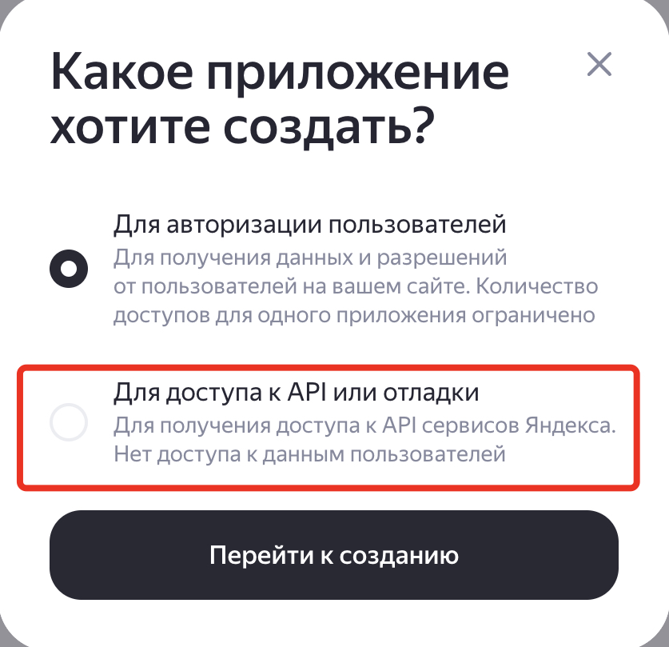
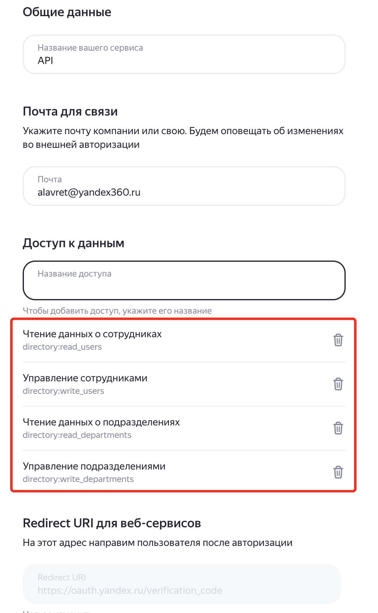

# Добавление пользователей в Yandex 360

## Обзор

Скрипт `add_users.py` предназначен для добавления новых пользователей в Yandex 360 через API. Он читает данные пользователей из CSV-файла (`users.csv`), проверяет их на корректность и отправляет запросы на создание пользователей в Yandex 360. Скрипт поддерживает режим "сухого прогона" (`DRY_RUN`) для тестирования без фактического создания пользователей, а также режим анализа файла для проверки данных без их отправки.

## Функциональность

Скрипт `add_users.py` предоставляет комплексное решение для управления пользователями в Yandex 360 с расширенными возможностями:

### Основные возможности

1. **Управление пользователями**:
   - Создание новых пользователей из CSV-файла
   - Обновление существующих пользователей из CSV-файла
   - Просмотр атрибутов существующих пользователей
   - Экспорт всех пользователей организации
   - Поиск пользователей по различным критериям

2. **Управление подразделениями**:
   - Поиск подразделений по ID, названию или алиасу
   - Создание иерархии подразделений
   - Автоматическое создание промежуточных подразделений
   - Просмотр структуры организации

3. **Обработка данных**:
   - Чтение данных из CSV-файла с поддержкой 14 полей
   - Валидация всех типов данных (пароли, email, телефоны, даты)
   - Маскировка чувствительных данных в логах
   - Обработка ошибок с повторными попытками

4. **Работа с паролями**:
   - Автоматическая генерация безопасных паролей
   - Валидация паролей по настраиваемому шаблону
   - Отправка email-уведомлений при смене пароля
   - Поддержка флага обязательной смены пароля

5. **Email-уведомления**:
   - Приветственные письма для новых пользователей
   - Уведомления об изменении пароля
   - HTML-шаблоны писем с поддержкой персонализации
   - SMTP с SSL для безопасной отправки

### Детальная функциональность

#### 1. **Чтение и валидация данных**:
   - Загружает данные пользователей из CSV-файла, указанного в переменной `USERS_FILE`
   - Поддерживает расширенный набор полей: логин, пароль, необходимость смены пароля, имя, фамилия, отчество, должность, пол, дата рождения, язык, рабочий и мобильный телефоны, личный email, отделы
   - Проверяет обязательные поля (логин, имя, фамилия, пароль, язык, пол, необходимость смены пароля)
   - Валидирует формат логина (латинские буквы, цифры, точки, дефисы, без начального подчёркивания)
   - Проверяет имена (кириллица, первая буква заглавная, возможен дефис)
   - Проверяет номера телефонов (допустимые символы: цифры, `+`, `-`, `(`, `)`, пробелы, точки; длина 3–16 цифр)
   - Проверяет дату рождения (форматы: `DD.MM.YYYY`, `DD-MM-YYYY`, `YYYY-MM-DD` и др.; возраст 10–100 лет)
   - Проверяет язык (`ru` или `en`) и пол (`male` или `female`)
   - **Валидация паролей**: Проверяет пароли по настраиваемому регулярному выражению
   - **Валидация email**: Проверяет корректность личных email адресов

#### 2. **Создание пользователей**:
   - Отправляет POST-запросы к API Yandex 360 (`https://api360.yandex.net/directory/v1/org/{orgId}/users`) для создания пользователей
   - Формирует JSON с данными пользователя, включая контакты (рабочий и мобильный телефоны, личный email), если они указаны
   - Поддерживает до 3 повторных попыток при ошибках запроса с задержкой в 1 секунду
   - Создает подразделения при необходимости
   - Отправляет приветственные письма новым пользователям (опционально)

#### 2.1. **Обновление пользователей**:
   - Поиск пользователей по логину (nickname или alias)
   - Сравнение существующих данных с новыми
   - Обновление только измененных полей через PATCH-запросы
   - Поддержка пустых полей (не изменяют существующие значения)
   - Автоматическая генерация паролей при необходимости
   - Отправка email-уведомлений при смене пароля
   - Обновление всех атрибутов: ФИО, должность, контакты, подразделение и др.

#### 3. **Интерактивное меню**:
   - **Опция 1**: Добавление пользователей из CSV-файла
   - **Опция 2**: Обновление существующих пользователей из CSV-файла
   - **Опция 3**: Анализ файла на ошибки без создания пользователей
   - **Опция 4**: Поиск подразделений по названию или алиасу
   - **Опция 5**: Просмотр атрибутов пользователя
   - **Опция 6**: Экспорт всех пользователей в файл
   - **Опция 0**: Выход из программы

#### 4. **Режимы работы**:
   - **Реальный режим**: Создание пользователей в Yandex 360
   - **Режим "сухого прогона"** (`DRY_RUN=true`): Имитация создания без изменений
   - **Режим анализа**: Проверка CSV-файла на ошибки без отправки данных

#### 5. **Логирование и безопасность**:
   - Логирует операции в консоль (уровень INFO) и в ротируемый файл `add_users.log` (уровень DEBUG)
   - Ротация файла происходит при достижении 1 МБ, сохраняется до 5 резервных копий
   - **Маскировка чувствительных данных**: Пароли и токены автоматически маскируются в логах
   - Обработка ошибок с подробным логированием

## Конфигурационные параметры

Скрипт использует следующие переменные окружения, которые можно задать в файле `.env` в каталоге скрипта или непосредственно в окружении:

| Имя параметра | Описание | Обязательный | Пример значения |
|---------------|----------|--------------|-----------------|
| `OAUTH_TOKEN` | OAuth-токен для аутентификации в API Yandex 360 | Да | `y0_AgAAAA...` |
| `ORG_ID` | Идентификатор организации в Yandex 360 (целочисленный) | Да | `123456` |
| `USERS_FILE` | Имя CSV-файла с данными пользователей | Да | `users.csv` |
| `DRY_RUN_ARG` | Режим "сухого прогона" (`true` для имитации, `false` для реального создания) | Нет (по умолчанию `false`) | `true` или `false` |
| `PASSWORD_PATTERN` | Регулярное выражение для валидации паролей | Нет | `^(?=.*[A-Z])(?=.*\d)(?=.*[!@#$%^&*()_+\-=\[\]{};:"\\|,.<>\/?]).{10,}$` |
| `DEPS_FILE` | Файл с информацией об отделах (по умолчанию `deps.csv`) | Нет | `deps.csv` |
| `ALL_USERS_FILE` | Файл для сохранения всех пользователей (по умолчанию `all_users.csv`) | Нет | `all_users.csv` |

### Пример файла `.env`:

```env
# OAuth токен для доступа к API Yandex 360
OAUTH_TOKEN=your_oauth_token_here

# ID организации в Yandex 360
ORG_ID=your_org_id_here

# Путь к файлу с пользователями
USERS_FILE=users.csv

# Режим пробного запуска (true/false)
DRY_RUN_ARG=false

# Регулярное выражение для проверки паролей
# По умолчанию: минимум 10 символов, заглавная буква, цифра, спецсимвол
PASSWORD_PATTERN=^(?=.*[A-Z])(?=.*\d)(?=.*[!@#$%^&*()_+\-=\[\]{};:"\\|,.<>\/?]).{10,}$

# Файл с информацией об отделах (опционально)
DEPS_FILE=deps.csv

# Файл для сохранения всех пользователей (опционально)
ALL_USERS_FILE=all_users.csv

# Автоматическая генерация паролей (true/false)
AUTO_GENERATE_PASSWORD=true

# Длина генерируемых паролей (минимум 12)
GENERATED_PASSWORD_LENGTH=16

# Отправка приветственных писем (true/false)
SEND_WELCOME_EMAIL=true

# Настройки SMTP для отправки email
# Используйте учетную запись пользователя из вашей организации Yandex 360
SMTP_SERVER=smtp.yandex.ru
SMTP_PORT=465
SMTP_LOGIN=notifications@example.com
# ВАЖНО: Используйте пароль приложения (получить на https://id.yandex.ru), а не обычный пароль!
SMTP_PASSWORD=your_app_password_here
SMTP_FROM_EMAIL=notifications@example.com
EMAIL_DOMAIN=example.ru
```

## Формат CSV-файла

CSV-файл (`users.csv`) должен содержать следующие столбцы (разделитель `;`):

> [!NOTE]
> **Комментарии в CSV-файле:**
> - Строки, начинающиеся с символа `#`, считаются комментариями и **не обрабатываются** скриптом
> - Это позволяет временно отключить обработку пользователей без удаления строк из файла
> - Комментарии можно использовать как для целых строк данных, так и для пояснительных записей

| Поле | Описание | Обязательное | Пример значения |
|------|----------|--------------|-----------------|
| `login` | Логин пользователя (латинские буквы, цифры, `.`, `-`, без `@domain`) | Да | `rpop-test1` |
| `password` | Пароль пользователя (проверяется по PASSWORD_PATTERN) | Да | `$rfvBgt5^yhn` |
| `password_change_required` | Требуется ли смена пароля (`true` или `false`) | Да | `false` |
| `first_name` | Имя (кириллица, первая буква заглавная) | Да | `Александр` |
| `last_name` | Фамилия (кириллица, первая буква заглавная) | Да | `Иванов` |
| `middle_name` | Отчество (кириллица, первая буква заглавная) | Нет | `Иванович` |
| `position` | Должность | Нет | `Директор` |
| `gender` | Пол (`male` или `female`) | Нет | `male` |
| `birthday` | Дата рождения (например, `DD.MM.YYYY`) | Нет | `01.01.2009` |
| `language` | Язык интерфейса (`ru` или `en`) | Нет | `ru` |
| `work_phone` | Рабочий телефон (цифры, `+`, `-`, `(`, `)`, пробелы, точки) | Нет | `+71231231212` |
| `mobile_phone` | Мобильный телефон (цифры, `+`, `-`, `(`, `)`, пробелы, точки) | Нет | `+71231231212` |
| `personal_email` | Личный email адрес (проверяется на корректность) | Нет | `alexander.ivanov@example.com` |
| `department` | Отделы (см. варианты использования ниже) | Нет | `123` или `Главный офис\|IT отдел\|Разработка` |

> [!NOTE]
> Личный email адрес записывается в виде JSON строки в атрибут `about` пользователя. Предполагается его использовать для уведомлений по почте пользователя о различных действиях с его учёткой в Я360 (в том числе, о новом пароле в случае сброса администратором)

### Варианты использования поля `department`

Поле `department` поддерживает два варианта указания подразделения:

#### Вариант 1: Указание по ID подразделения
Укажите числовое значение, которое соответствует полю `DepartmentId` для соответствующего подразделения:
```
department
123
456
789
```

#### Вариант 2: Указание иерархии подразделений
Укажите иерархию подразделений, начиная с верхнего уровня и заканчивая подразделением, где необходимо разместить пользователя. Имена подразделений разделяйте вертикальной чертой (`|`):

**Примеры:**
```
department
Главный офис|IT отдел|Разработка
Главный офис|HR отдел
Филиал Москва|Отдел продаж
```

**Поведение системы:**
- Если подразделение существует → пользователь добавляется в него
- Если подразделения нет → создается вместе со всеми промежуточными подразделениями в иерархии

**Пример создания иерархии:**
При указании `Главный офис|IT отдел|Разработка` система:
1. Проверит существование "Главный офис"
2. Если нет → создаст "Главный офис"
3. Проверит существование "IT отдел" внутри "Главный офис"
4. Если нет → создаст "IT отдел" внутри "Главный офис"
5. Проверит существование "Разработка" внутри "IT отдел"
6. Если нет → создаст "Разработка" внутри "IT отдел"
7. Добавит пользователя в "Разработка"

### Пример файла `users.csv`:

```csv
login;password;password_change_required;first_name;last_name;middle_name;position;gender;birthday;language;work_phone;mobile_phone;personal_email;department
# Это комментарий - строка не будет обработана
rpop-test7;$rfvBgt5^yhn;false;Александр;Иванов;Иванович;Директор;male;01.01.2009;ru;+71231231212;+7 123 1231212;alexander.ivanov@example.com;123
#rpop-test8;$rfvBgt5^yhn;true;Мария;Петрова;Петровна;Администратор;female;05.05.1990;en;+798345623;+7 (123) 123-12-12;maria.petrova@example.com;Главный офис|HR отдел
rpop-test9;$rfvBgt5^yhn;true;Павел;Сидоров;Александрович;Менеджер;male;20.06.2000;ru;+71234567890;+71231231212;pavel.sidorov@example.com;Главный офис|IT отдел|Разработка
```

> [!TIP]
> В примере выше:
> - Первая строка с комментарием будет полностью пропущена
> - Строка с `rpop-test8` закомментирована символом `#` и не будет обработана
> - Только `rpop-test7` и `rpop-test9` будут обработаны скриптом

## Обновление пользователей из файла

### Описание функциональности

Функция обновления позволяет изменять данные существующих пользователей в Yandex 360, используя тот же формат CSV-файла, что и для создания пользователей.

### Основные особенности

1. **Поиск пользователей**:
   - Пользователь ищется по логину из CSV-файла
   - Поиск выполняется по полю `nickname` и всем `aliases` пользователя
   - Если пользователь не найден, строка пропускается с ошибкой

2. **Умное обновление**:
   - Обновляются **только измененные поля**
   - Пустые поля в CSV **не изменяют** существующие значения
   - Сравнение происходит перед отправкой запроса к API

3. **Обработка паролей**:
   - Если `password` указан → пароль обновляется
   - Если `password_change_required=true` и `password` пустой → пароль генерируется автоматически (при `AUTO_GENERATE_PASSWORD=true`)
   - При смене пароля автоматически отправляется email-уведомление на `personal_email` пользователя

4. **Email-уведомления**:
   - При изменении пароля пользователю отправляется письмо на личный email
   - Email берется из поля `about` пользователя (где хранится в формате JSON)
   - Если `personal_email` указан в CSV, он также обновляется в поле `about`
   - Используется HTML-шаблон `password_change_template.html`

### Формат CSV-файла для обновления

Используется **тот же формат**, что и для создания пользователей:

```csv
login;password;password_change_required;first_name;last_name;middle_name;position;gender;birthday;language;work_phone;mobile_phone;personal_email;department
```

> [!NOTE]
> Строки, начинающиеся с `#`, не обрабатываются. Это позволяет временно отключить обновление конкретных пользователей.

### Примеры использования

#### Пример 1: Обновление должности
```csv
login;password;password_change_required;first_name;last_name;middle_name;position;gender;birthday;language;work_phone;mobile_phone;personal_email;department
rpop-test7;;;;;;;;Главный директор;;;;;;;
# Следующая строка закомментирована и не будет обработана
#rpop-test6;;;;;;;;Заместитель директора;;;;;;;
```
Обновит только должность пользователя `rpop-test7` на "Главный директор". Пользователь `rpop-test6` не будет обработан.

#### Пример 2: Смена пароля с уведомлением
```csv
login;password;password_change_required;first_name;last_name;middle_name;position;gender;birthday;language;work_phone;mobile_phone;personal_email;department
rpop-test8;;true;;;;;;;;;;
```
Сгенерирует новый пароль для `rpop-test8`, установит флаг обязательной смены и отправит письмо на email пользователя.

#### Пример 3: Полное обновление данных
```csv
login;password;password_change_required;first_name;last_name;middle_name;position;gender;birthday;language;work_phone;mobile_phone;personal_email;department
rpop-test9;NewP@ssw0rd!;false;Павел;Сидоров;Александрович;Старший менеджер;male;20.06.2000;ru;+79991234567;+79997654321;new.email@example.com;Главный офис|IT отдел|Разработка
```
Обновит все указанные поля пользователя `rpop-test9`.

#### Пример 4: Обновление телефонов и email
```csv
login;password;password_change_required;first_name;last_name;middle_name;position;gender;birthday;language;work_phone;mobile_phone;personal_email;department
maria.petrova;;;;;;;;;;+79001234567;+79009876543;maria.new@example.com;
```
Обновит только телефоны и email пользователя `maria.petrova`.

### Правила обновления полей

| Поле | Правило обновления |
|------|-------------------|
| `login` | **Обязательное**. Используется для поиска пользователя. Не обновляется. |
| `password` | Если указан → обновляется. Если пустой и `password_change_required=true` → генерируется. |
| `password_change_required` | Если указан (`true`/`false`) → обновляется флаг. |
| `first_name`, `last_name`, `middle_name` | Если указаны → обновляются. Пустые → не изменяются. |
| `position` | Если указана → обновляется. Пустая → не изменяется. |
| `gender` | Если указан → обновляется. Пустой → не изменяется. |
| `birthday` | Если указана → обновляется. Пустая → не изменяется. |
| `language` | Если указан → обновляется. Пустой → не изменяется. |
| `work_phone`, `mobile_phone` | Если указаны → обновляются контакты (старые телефоны заменяются). |
| `personal_email` | Если указан → обновляется в поле `about` (JSON). |
| `department` | Если указано → обновляется подразделение пользователя. |

### Процесс обновления

1. **Фаза 1: Валидация**
   - Чтение CSV-файла
   - Поиск каждого пользователя по логину
   - Валидация всех входных данных
   - Проверка существования подразделений

2. **Фаза 2: Обновление**
   - Сравнение новых данных с существующими
   - Формирование PATCH-запроса только для измененных полей
   - Обновление пользователя через API
   - Отправка email при смене пароля

### Логирование

Все операции подробно логируются:
```
2025-10-06 12:00:00.123 INFO: Обработка пользователя: rpop-test7 (ID: 1130000000012345)
2025-10-06 12:00:00.234 DEBUG:   Изменение должности: Менеджер -> Главный директор
2025-10-06 12:00:00.345 DEBUG:   Изменение пароля
2025-10-06 12:00:00.456 INFO: Успех - пользователь rpop-test7 обновлен.
2025-10-06 12:00:00.567 INFO: Email успешно отправлен на адрес user@example.com
```

### Настройка email-уведомлений

Для отправки писем при смене пароля необходимо настроить SMTP в `.env`:

```env
# Включить отправку email при смене пароля
SEND_WELCOME_EMAIL=true

# Настройки SMTP
SMTP_SERVER=smtp.yandex.ru
SMTP_PORT=465
SMTP_LOGIN=notifications@example.com
SMTP_PASSWORD=your_smtp_password
SMTP_FROM_EMAIL=noreply@example.com
EMAIL_DOMAIN=example.ru
```

#### Использование учетной записи Yandex 360 для отправки писем

Вы можете использовать учетную запись пользователя из вашей организации Yandex 360 для отправки SMTP-писем. Это удобно, так как не требует создания отдельного почтового сервиса.

**Преимущества:**
- ✅ Не нужен отдельный SMTP-сервер
- ✅ Письма отправляются от имени пользователя вашей организации
- ✅ Встроенная защита от спама и фишинга
- ✅ Бесплатно в рамках Yandex 360

**Шаги настройки:**

1. **Создайте или выберите пользователя для отправки уведомлений**
   - Рекомендуется создать отдельного служебного пользователя (например, `notifications@ваш-домен.ru`)
   - Или используйте существующего пользователя с правами администратора

2. **Получите пароль приложения для SMTP**
   
   > [!IMPORTANT]
   > Для SMTP-подключения нужен **пароль приложения**, а не обычный пароль от аккаунта!
   
   Пошаговая инструкция:
   
   a. Перейдите на страницу управления паролями приложений: https://id.yandex.ru
   
   b. Войдите под учетной записью пользователя, от имени которого будут отправляться письма
   
   c. В разделе **"Безопасность"** найдите пункт **"Пароли приложений"**
   
   d. Нажмите **"Создать новый пароль"**
   
   e. В открывшемся окне:
      - Выберите сервис: **"Почта"**
      - Введите название: например, **"SMTP для уведомлений Yandex 360"**
      - Нажмите **"Создать"**
   
   f. **Скопируйте сгенерированный пароль** (он будет показан только один раз!)
   
   g. Сохраните этот пароль в надежном месте

3. **Настройте параметры в файле `.env`:**

```env
# Включить отправку email
SEND_WELCOME_EMAIL=true

# SMTP сервер Яндекс
SMTP_SERVER=smtp.yandex.ru
SMTP_PORT=465

# Email пользователя из вашей организации Yandex 360
SMTP_LOGIN=notifications@ваш-домен.ru

# Пароль приложения (НЕ обычный пароль!)
SMTP_PASSWORD=полученный_пароль_приложения

# Email отправителя (тот же, что и SMTP_LOGIN)
SMTP_FROM_EMAIL=notifications@ваш-домен.ru

# Домен вашей организации
EMAIL_DOMAIN=ваш-домен.ru
```

**Пример конфигурации:**

```env
SEND_WELCOME_EMAIL=true
SMTP_SERVER=smtp.yandex.ru
SMTP_PORT=465
SMTP_LOGIN=notifications@mycompany.ru
SMTP_PASSWORD=abcd1234efgh5678ijkl
SMTP_FROM_EMAIL=notifications@mycompany.ru
EMAIL_DOMAIN=mycompany.ru
```

**Важные замечания:**

- 🔐 **Пароль приложения** отличается от обычного пароля и используется только для SMTP-подключения
- 🔒 **Безопасность**: Пароль приложения можно отозвать в любой момент на странице https://id.yandex.ru
- 📧 **Отправитель**: Письма будут приходить от имени указанного пользователя (например, `notifications@mycompany.ru`)
- ⚠️ **Лимиты**: Yandex имеет лимиты на количество отправляемых писем (обычно достаточно для корпоративных нужд)

**Альтернативные варианты:**

Если вам не подходит использование Yandex SMTP, вы можете настроить:
- Gmail SMTP (требуется пароль приложения)
- Microsoft 365 SMTP
- Корпоративный SMTP-сервер
- SendGrid, Mailgun или другие сервисы email-рассылок

### HTML-шаблоны писем

Скрипт использует два HTML-шаблона для email-уведомлений, расположенных в корневой директории проекта.

#### Шаблон 1: email_template.html (Приветственное письмо)

Используется при создании новых пользователей (опция меню 1). Содержит:
- Приветствие нового пользователя
- Данные для входа (логин и пароль)
- Информацию о должности и подразделении
- Предупреждение о необходимости смены пароля (если установлено)
- Ссылки на ресурсы организации

**Когда отправляется:**
- При создании нового пользователя (если `SEND_WELCOME_EMAIL=true`)
- Только если указан `personal_email` в CSV-файле

#### Шаблон 2: password_change_template.html (Смена пароля)

Используется при обновлении пароля существующих пользователей (опция меню 2). Содержит:
- Уведомление об изменении пароля
- Новый пароль
- Рекомендации по безопасности
- Предупреждение о необходимости смены пароля (если установлено)

**Когда отправляется:**
- При обновлении пользователя с изменением пароля
- Автоматически извлекается `personal_email` из поля `about` пользователя

### Переменные шаблонов

Оба шаблона поддерживают подстановку следующих переменных:

| Переменная | Описание | Пример значения |
|------------|----------|-----------------|
| `{{first_name}}` | Имя пользователя | `Александр` |
| `{{middle_name}}` | Отчество пользователя | `Иванович` |
| `{{last_name}}` | Фамилия пользователя | `Иванов` |
| `{{login}}` | Логин пользователя (без домена) | `alexander.ivanov` |
| `{{password}}` | Пароль пользователя (открытым текстом) | `$rfvBgt5^yhn` |
| `{{domain}}` | Домен организации в Yandex 360 | `example.ru` |
| `{{position}}` | Должность пользователя | `Директор` |
| `{{department}}` | Название подразделения | `IT отдел` |
| `{{year}}` | Текущий год | `2025` |

### Условные блоки в шаблонах

Шаблоны поддерживают простые условные блоки для динамического отображения контента:

#### 1. Блок password_change_required

```html
{{#if password_change_required}}
<div class="warning-box">
    <p><strong>⚠️ Важно!</strong></p>
    <p>Вам необходимо изменить этот пароль при первом входе в систему.</p>
</div>
{{else}}
<div class="info-box">
    <p>Вы можете использовать этот пароль для постоянного входа.</p>
</div>
{{/if}}
```

**Логика работы:**
- Если `password_change_required=true` → отображается блок между `{{#if}}` и `{{else}}`
- Если `password_change_required=false` → отображается блок между `{{else}}` и `{{/if}}`
- Блок `{{else}}` опционален

#### 2. Блок position

```html
{{#if position}}
<p><strong>Должность:</strong> {{position}}</p>
{{/if}}
```

**Логика работы:**
- Если поле `position` заполнено → блок отображается
- Если поле пустое → блок полностью удаляется из письма

#### 3. Блок department

```html
{{#if department}}
<p><strong>Подразделение:</strong> {{department}}</p>
{{/if}}
```

**Логика работы:**
- Если поле `department` заполнено → блок отображается
- Если поле пустое → блок полностью удаляется из письма

### Пример использования переменных

**Входные данные:**
```csv
login;password;password_change_required;first_name;last_name;middle_name;position;gender;birthday;language;work_phone;mobile_phone;personal_email;department
alexander.ivanov;$rfvBgt5^yhn;true;Александр;Иванов;Иванович;Директор;male;01.01.1980;ru;+71231231212;;alex@example.com;IT отдел
```

**Результат в письме:**
```
Здравствуйте, Александр Иванович!

Ваш логин: alexander.ivanov@example.ru
Ваш пароль: $rfvBgt5^yhn

Должность: Директор
Подразделение: IT отдел

⚠️ Важно!
Вам необходимо изменить этот пароль при первом входе в систему.
```

### Настройка шаблонов

#### Изменение дизайна

Шаблоны написаны на чистом HTML с встроенными CSS-стилями (inline styles). Вы можете:

1. **Изменить цветовую схему:**
```html
<!-- Найдите в шаблоне и измените цвета -->
<style>
    .header h1 {
        color: #4CAF50;  /* Измените на ваш корпоративный цвет */
    }
</style>
```

2. **Добавить логотип компании:**
```html
<div class="header">
    
    <h1>🔒 Добро пожаловать!</h1>
</div>
```

3. **Изменить структуру письма:**
```html
<!-- Добавьте новые секции -->
<div class="section">
    <h2>Полезные ссылки</h2>
    <ul>
        <li><a href="https://example.com/help">Справка</a></li>
        <li><a href="https://example.com/support">Техподдержка</a></li>
    </ul>
</div>
```

#### Добавление новых переменных

Если вам нужны дополнительные переменные, отредактируйте функцию `render_email_template()` в `add_users.py`:

```python
def render_email_template(template: str, user_data: dict, settings: "SettingParams") -> str:
    # Существующие подстановки
    rendered = template.replace('{{first_name}}', user_data.get('first', ''))
    
    # Добавьте новые подстановки
    rendered = rendered.replace('{{company_name}}', 'Моя Компания')
    rendered = rendered.replace('{{support_email}}', 'support@example.com')
    
    return rendered
```

Затем используйте в шаблоне:
```html
<p>Если у вас возникли вопросы, напишите нам: {{support_email}}</p>
```

#### Создание кастомных шаблонов

Вы можете создать собственные шаблоны для специальных случаев:

1. **Создайте новый HTML-файл** (например, `password_reset_template.html`)

2. **Используйте существующий шаблон как основу:**
```bash
cp email_template.html my_custom_template.html
```

3. **Измените константу в коде** (если нужно):
```python
# В add_users.py
CUSTOM_TEMPLATE_FILE = "my_custom_template.html"
```

4. **Используйте в коде:**
```python
template = load_email_template(CUSTOM_TEMPLATE_FILE)
html_body = render_email_template(template, user_data, settings)
```

### Тестирование шаблонов

#### Локальный просмотр

Откройте HTML-шаблон в браузере для предварительного просмотра:

```bash
open email_template.html  # macOS
# или
start email_template.html  # Windows
# или
xdg-open email_template.html  # Linux
```

**Примечание:** Переменные `{{...}}` будут отображаться как есть. Для полноценного тестирования используйте режим `DRY_RUN`.

#### Тестирование с реальными данными

1. **Включите DRY_RUN и отправку email:**
```env
DRY_RUN=false
SEND_WELCOME_EMAIL=true
```

2. **Подготовьте тестового пользователя:**
```csv
login;password;password_change_required;first_name;last_name;middle_name;position;gender;birthday;language;work_phone;mobile_phone;personal_email;department
test.user;TestP@ss123;true;Тест;Тестов;Тестович;Тестировщик;male;01.01.1990;ru;;;your.email@example.com;
```

3. **Запустите создание/обновление:**
```bash
python add_users.py
# Выберите опцию 1 или 2
```

4. **Проверьте письмо** на указанном `personal_email`

### Безопасность шаблонов

⚠️ **Важные замечания:**

1. **Пароли в открытом виде:**
   - Пароли отправляются в открытом виде в письме
   - Используйте только защищенные SMTP-соединения (SSL/TLS)
   - Рекомендуйте пользователям немедленно менять пароль

2. **Защита от спама:**
   - Не храните пароли в архиве отправленных писем
   - Настройте SPF, DKIM и DMARC записи для вашего домена
   - Используйте выделенный email для уведомлений

3. **Персональные данные:**
   - Шаблоны содержат ФИО и должность
   - Убедитесь, что SMTP-сервер соответствует требованиям GDPR/152-ФЗ
   - Не пересылайте письма третьим лицам

### Решение проблем

| Проблема | Решение |
|----------|---------|
| Письма не отправляются | Проверьте настройки SMTP в `.env`, убедитесь, что `SEND_WELCOME_EMAIL=true` |
| Переменные не подставляются | Проверьте синтаксис `{{variable}}`, убедитесь, что данные есть в CSV |
| Кириллица отображается неправильно | Убедитесь, что шаблон сохранен в UTF-8, проверьте настройки SMTP |
| Условные блоки не работают | Проверьте синтаксис `{{#if}}...{{/if}}`, убедитесь в правильности закрывающих тегов |
| Стили не применяются | Используйте inline CSS (`style="..."`), почтовые клиенты не всегда поддерживают `<style>` |
| Письмо попадает в спам | Настройте SPF/DKIM/DMARC, используйте проверенный SMTP-сервер |

### Примеры шаблонов для разных сценариев

#### Минималистичный шаблон

```html
<!DOCTYPE html>
<html>
<head>
    <meta charset="UTF-8">
</head>
<body style="font-family: Arial, sans-serif; padding: 20px;">
    <p>Здравствуйте, {{first_name}}!</p>
    <p>Ваши данные для входа:</p>
    <p><strong>Логин:</strong> {{login}}@{{domain}}</p>
    <p><strong>Пароль:</strong> {{password}}</p>
    {{#if password_change_required}}
    <p style="color: red;">Необходимо сменить пароль при первом входе.</p>
    {{/if}}
    <p>С уважением,<br>Служба поддержки</p>
</body>
</html>
```

#### Корпоративный шаблон с таблицей

```html
<div style="max-width: 600px; margin: 0 auto; font-family: Arial, sans-serif;">
    <h2 style="color: #333;">Добро пожаловать в компанию!</h2>
    <table style="width: 100%; border-collapse: collapse; margin: 20px 0;">
        <tr>
            <td style="padding: 10px; border: 1px solid #ddd; background: #f9f9f9;"><strong>ФИО:</strong></td>
            <td style="padding: 10px; border: 1px solid #ddd;">{{last_name}} {{first_name}} {{middle_name}}</td>
        </tr>
        <tr>
            <td style="padding: 10px; border: 1px solid #ddd; background: #f9f9f9;"><strong>Логин:</strong></td>
            <td style="padding: 10px; border: 1px solid #ddd;">{{login}}@{{domain}}</td>
        </tr>
        <tr>
            <td style="padding: 10px; border: 1px solid #ddd; background: #f9f9f9;"><strong>Пароль:</strong></td>
            <td style="padding: 10px; border: 1px solid #ddd;">{{password}}</td>
        </tr>
        {{#if position}}
        <tr>
            <td style="padding: 10px; border: 1px solid #ddd; background: #f9f9f9;"><strong>Должность:</strong></td>
            <td style="padding: 10px; border: 1px solid #ddd;">{{position}}</td>
        </tr>
        {{/if}}
    </table>
</div>
```

### Безопасность

- Пароли маскируются во всех логах
- Email отправляются через SMTP с SSL (порт 465)
- Генерируемые пароли криптографически стойкие (используется модуль `secrets`)
- Personal email хранится в зашифрованном поле `about` в формате JSON


## Валидация данных

### Валидация паролей

Скрипт проверяет пароли по регулярному выражению, заданному в переменной `PASSWORD_PATTERN`. По умолчанию требуется:
- Минимум 10 символов
- Хотя бы одна заглавная буква
- Хотя бы одна цифра
- Хотя бы один спецсимвол из набора: `!@#$%^&*()_+-=[]{};:"\\|,.<>/?`

### Валидация email адресов

Личные email адреса проверяются на корректность согласно стандартам RFC:
- Наличие символа `@`
- Корректный формат локальной части и домена
- Длина локальной части не более 64 символов
- Длина домена не более 253 символов
- Отсутствие последовательных точек

### Маскировка чувствительных данных

В логах автоматически маскируются:
- Пароли пользователей
- OAuth токены
- Токены доступа
- Любые поля с названием "token"
## Настройка OAuth приложения

1. Для использования приложения необходимо сгенерировать OAuth токен для аутентификации в Yandex 360 API. Токен должен содержать необходимые права для выполнения операций управления ресурсами в организации Yandex 360. Документация - [Создание приложения](https://yandex.ru/dev/id/doc/ru/register-client).

Последовательность шагов для создания токена:
* перейдите на https://oauth.yandex.ru/client/new/. Аутентифицируйтесь от имени администратора организации Yandex 360
* В предлагаемом окне выберите "Для доступа к API или отладке" и нажмите "Перейти к созданию".



* заполните поля в форме создания приложения:
  - поле "Название вашего сервиса" - любое название
  - проверьте почту для связи

* добавьте разрешения для токена. Для этого в разделе "Доступ к данным" найдите и добавьте следующие разрешения:

| Название разрешения | Что можно делать |
|-------------------|------------------|
| directory:read_users | читать атрибуты пользователей |
| directory:write_users | создавать пользователей и записывать в атрибуты пользователей |
| directory:read_departments   | читать атрибуты подразделений
|directory:write_departments | создавать подразделения и записывать в атрибуты подразделений



* нажмите кнопку "Создать приложение"
* закройте окно с предложением пройти верификацию через Госуслуги
* в новом окне "Мои приложения" отображаются свойства созданного приложения. Найдите раздел с ID созданного приложения и скопируйте строку из поля "ClientID":


* в текстовом редакторе создайте строку вида `https://oauth.yandex.ru/authorize?response_type=token&client_id=<ID приложения>` и вставьте скопированное значение ClientID из предыдущего шага вместо `<ID приложения>`

Вставьте получившуюся ссылку в браузер и нажмите "Enter".
* в окне браузера появляется запрос на подтверждение прав токена. Подтверждение **должно выполняться с аккаунта администратора организации** (если это сделать от имени обычного пользователя, токен не получит запрашиваемые права из-за отсутствия необходимых разрешений у данного пользовательского аккаунта).
Нажмите "Войти как" и получите необходимый токен доступа.

> [!WARNING]
> Скопируйте токен и сохраните его в безопасном месте.

2. Получите ID организации в Yandex 360. Для этого перейдите в [консоль администрирования](admin.yandex.ru) и в левом нижнем углу интерфейса будет необходимый номер.


3. Запишите полученные на предыдущем шаге OAuth токен и Org ID в соответствующие переменные в файле `.env` в том же каталоге, что и сами скрипты.

## Установка

1. **Установите Python**: Требуется Python 3.9 или выше.

2. **Установите зависимости**:
   
   Скрипт использует следующие Python-пакеты:

   | Пакет | Версия | Назначение |
   |-------|--------|------------|
   | `python-dotenv` | 1.1.0 | Загрузка переменных окружения из `.env` |
   | `requests` | 2.32.3 | HTTP-запросы к API Yandex 360 |
   | `certifi` | 2025.1.31 | SSL-сертификаты для безопасных соединений |
   | `charset-normalizer` | 3.4.1 | Определение кодировки текста |
   | `idna` | 3.10 | Обработка международных доменных имен |
   | `urllib3` | 2.3.0 | HTTP-клиент низкого уровня |

   **Способ 1: Установка из requirements.txt (рекомендуется)**
   ```bash
   pip install -r requirements.txt
   ```

   **Способ 2: Установка основных пакетов**
   ```bash
   pip install python-dotenv requests
   ```

   **Способ 3: Создание виртуального окружения (рекомендуется)**
   ```bash
   # Создание виртуального окружения
   python -m venv venv
   
   # Активация (Linux/macOS)
   source venv/bin/activate
   
   # Активация (Windows)
   venv\Scripts\activate
   
   # Установка зависимостей
   pip install -r requirements.txt
   ```

3. **Проверьте установку**:
   ```bash
   # Проверка версии Python
   python --version
   
   # Проверка установленных пакетов
   pip list
   
   # Проверка конкретных пакетов
   python -c "import requests, dotenv; print('Все пакеты установлены успешно')"
   ```

4. **Настройте окружение**:
   - Создайте файл `.env` в каталоге скрипта с необходимыми параметрами (см. пример выше).
   - Подготовьте CSV-файл (`users.csv`) с данными пользователей в правильном формате.
   - Убедитесь, что у вас есть действующий OAuth-токен и ID организации Yandex 360.

### Системные требования

- **Python**: 3.7 или выше
- **Операционная система**: Windows, macOS, Linux
- **Память**: минимум 512 МБ RAM
- **Дисковое пространство**: 50 МБ для установки зависимостей
- **Сеть**: доступ к интернету для работы с API Yandex 360

### Устранение проблем

**Ошибка "ModuleNotFoundError"**:
```bash
# Переустановите зависимости
pip install --upgrade -r requirements.txt
```

**Проблемы с SSL-сертификатами**:
```bash
# Обновите certifi
pip install --upgrade certifi
```

**Конфликты версий**:
```bash
# Используйте виртуальное окружение
python -m venv venv
source venv/bin/activate  # Linux/macOS
# или
venv\Scripts\activate     # Windows
pip install -r requirements.txt
```

## Запуск

1. **Подготовка**:
   - Поместите скрипт `add_users.py` и файл `users.csv` в рабочий каталог.
   - Создайте и заполните файл `.env` или задайте переменные окружения.

2. **Запуск скрипта**:
   ```bash
   python add_users.py
   ```
   Это откроет интерактивное меню.

3. **Использование меню**:
   
   После запуска скрипта откроется интерактивное меню с следующими опциями:

   | Опция | Описание | Функциональность |
   |-------|----------|------------------|
   | `1` | Добавить пользователей из файла | Создание новых пользователей в Yandex 360 из CSV-файла |
   | `2` | Обновить сотрудников из файла | Обновление существующих пользователей в Yandex 360 из CSV-файла |
   | `3` | Анализировать входной файл на ошибки | Проверка CSV-файла без создания пользователей |
   | `4` | Поиск подразделения по названию или алиасу | Поиск существующих подразделений в организации |
   | `5` | Показать атрибуты пользователя | Просмотр информации о конкретном пользователе |
   | `6` | Выгрузить всех пользователей в файл | Экспорт всех пользователей организации в CSV |
   | `0` | Выход | Завершение работы программы |

   ### Подробное описание опций:

   **Опция 1: Добавление пользователей**
   - Читает данные из CSV-файла, указанного в `USERS_FILE`
   - Проверяет корректность всех данных (пароли, email, телефоны и т.д.)
   - Создает пользователей в Yandex 360 через API
   - В режиме `DRY_RUN=true` только имитирует создание
   - При обнаружении подозрительных данных запрашивает подтверждение

   **Опция 2: Обновление пользователей**
   - Читает данные из CSV-файла, указанного в `USERS_FILE`
   - Находит каждого пользователя по логину (nickname или alias)
   - Сравнивает новые данные с существующими
   - Обновляет только измененные поля
   - Пустые поля в CSV не изменяют существующие значения
   - При смене пароля автоматически отправляет email-уведомление
   - Поддерживает автогенерацию паролей

   **Опция 3: Анализ файла**
   - Проверяет CSV-файл на ошибки без отправки данных в API
   - Выводит подробный отчет о найденных проблемах
   - Показывает количество корректных и некорректных записей
   - Рекомендуется использовать перед реальным добавлением пользователей

   **Опция 4: Поиск подразделений**
   - Позволяет найти подразделения по ID, названию или алиасу
   - Показывает иерархию подразделений
   - Помогает определить правильные ID для поля `department`
   - Поддерживает поиск по части названия

   **Опция 5: Просмотр атрибутов пользователя**
   - Поиск пользователя по UID, никнейму, алиасу или фамилии
   - Отображение полной информации о пользователе
   - Показывает контакты, подразделения и другие атрибуты
   - Полезно для проверки существующих пользователей

   **Опция 6: Экспорт пользователей**
   - Загружает всех пользователей организации из Yandex 360
   - Сохраняет данные в файл, указанный в `ALL_USERS_FILE`
   - Включает полную информацию о пользователях и их подразделениях
   - Полезно для создания резервных копий или анализа структуры

4. **Пример работы**:
   
   **Типичный рабочий процесс:**
   
   1. **Подготовка данных:**
      - Запустите скрипт: `python add_users.py`
      - Выберите `3` для проверки `users.csv` на ошибки
      - Исправьте ошибки в файле, если они найдены
   
   2. **Проверка подразделений:**
      - Выберите `4` для поиска подразделений
      - Найдите нужные ID подразделений или проверьте иерархию
      - Обновите поле `department` в CSV-файле при необходимости
   
   3. **Добавление пользователей:**
      - Выберите `1` для добавления новых пользователей
      - Подтвердите продолжение, если есть подозрительные строки
      - Проверьте логи в `add_users.log` и консоль для результатов
   
   4. **Обновление пользователей:**
      - Подготовьте CSV-файл с данными для обновления (используйте тот же формат)
      - Выберите `2` для обновления существующих пользователей
      - Скрипт найдет пользователей по логину и обновит измененные поля
      - При смене пароля пользователи получат email-уведомления
   
   5. **Проверка результатов:**
      - Выберите `5` для просмотра атрибутов пользователей
      - Выберите `6` для экспорта всех пользователей в файл
      - Проверьте корректность созданных/обновленных записей

## Логирование

- **Консоль**: Сообщения уровня INFO с временными метками (например, `2023-10-01 12:00:00.123 INFO: Добавление пользователей...`).
- **Файл**: Сообщения уровня DEBUG записываются в `add_users.log`, ротация происходит при достижении 10 МБ (хранится 5 резервных копий).
- Формат логов: `%(asctime)s.%(msecs)03d %(levelname)s:\t%(message)s` с форматом даты `ГГГГ-ММ-ДД ЧЧ:ММ:СС`.
- **Безопасность**: Чувствительные данные (пароли, токены) автоматически маскируются в логах.

## Обработка ошибок

- **Ошибки конфигурации**: Отсутствие переменных `OAUTH_TOKEN`, `ORG_ID` или `USERS_FILE` приводит к завершению с ошибкой.
- **Ошибки данных**: Некорректные строки в CSV-файле (например, пустые обязательные поля, неверный формат телефона, некорректные пароли или email) логируются как ошибки, и процесс останавливается.
- **Ошибки API**: Обрабатываются с повторными попытками (до 3 раз). Ошибки аутентификации (401, 403) или неверные запросы (400) логируются.
- **Подозрительные строки**: Строки с потенциально некорректными данными (например, некириллические имена) логируются как предупреждения, и пользователь решает, продолжать ли.

## Ограничения

- **Формат логина**: Логин не должен содержать `@domain`, начинаться с `_` или включать символы, кроме латинских букв, цифр, `.`, `-`.
- **Имена**: Имена, фамилии и отчества должны быть на кириллице с заглавной первой буквой, возможен дефис.
- **Телефоны**: Длина номера 3–16 цифр, поддерживаются международные и российские форматы.
- **Дата рождения**: Возраст должен быть от 10 до 100 лет.
- **Пароли**: Должны соответствовать регулярному выражению в `PASSWORD_PATTERN`.
- **Email**: Должен соответствовать стандартам RFC для email адресов.
- **API-запросы**: Ограничены скоростью (обрабатывается код 429 с ожиданием по заголовку `Retry-After`).

## Дополнительная документация

- [EMAIL_VALIDATION_README.md](EMAIL_VALIDATION_README.md) - Подробное описание валидации email адресов
- [EMAIL_SENDING_README.md](EMAIL_SENDING_README.md) - Подробное описание настройки и отправки email-уведомлений
- [PASSWORD_VALIDATION_README.md](PASSWORD_VALIDATION_README.md) - Подробное описание валидации паролей
- [PASSWORD_GENERATION_README.md](PASSWORD_GENERATION_README.md) - Подробное описание генерации паролей
- [PASSWORD_MASKING_README.md](PASSWORD_MASKING_README.md) - Подробное описание маскировки чувствительных данных

## Лицензия

Проект распространяется под лицензией MIT. Подробности см. в файле `LICENSE`.