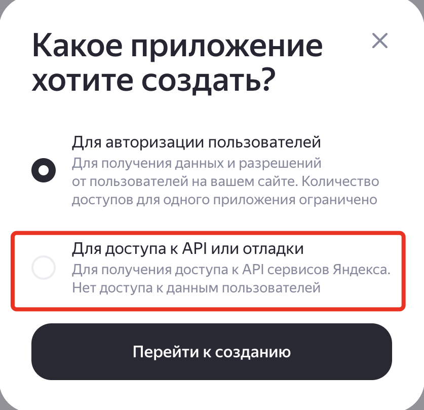
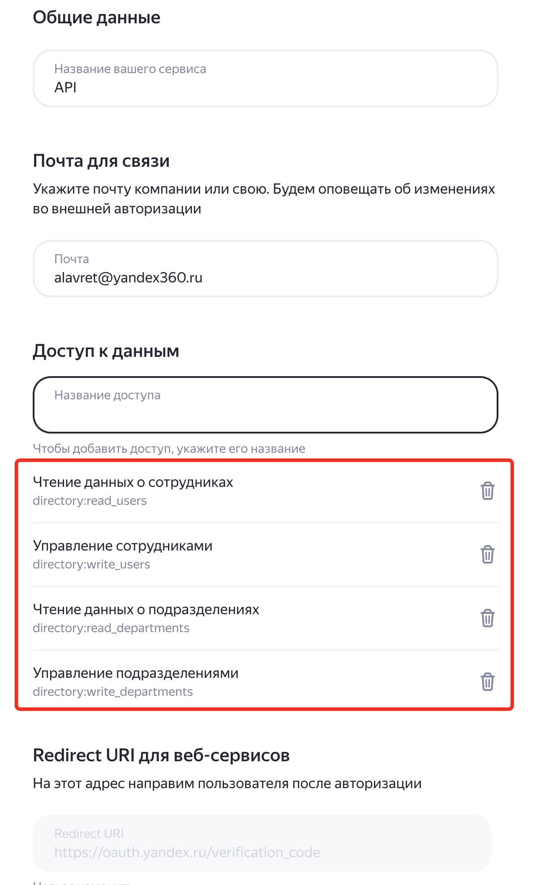
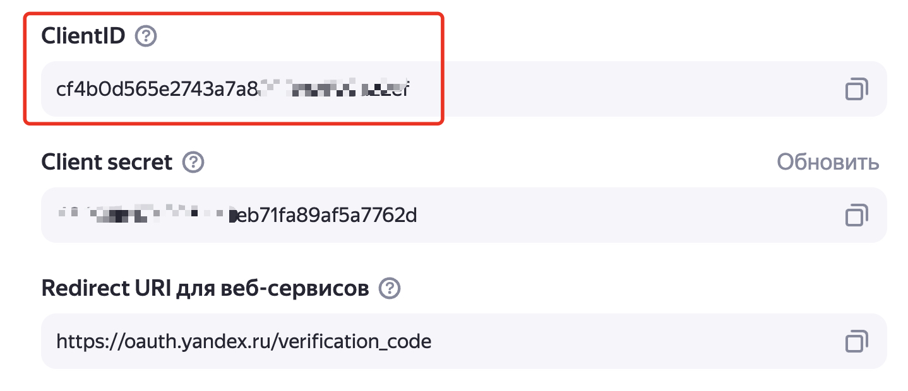

# Добавление пользователей в Yandex 360

## Обзор

Скрипт `add_users.py` предназначен для добавления новых пользователей в Yandex 360 через API. Он читает данные пользователей из CSV-файла (`users.csv`), проверяет их на корректность и отправляет запросы на создание пользователей в Yandex 360. Скрипт поддерживает режим "сухого прогона" (`DRY_RUN`) для тестирования без фактического создания пользователей, а также режим анализа файла для проверки данных без их отправки.

## Функциональность

Скрипт `add_users.py` предоставляет комплексное решение для управления пользователями в Yandex 360 с расширенными возможностями:

### Основные возможности

1. **Управление пользователями**:
   - Создание новых пользователей из CSV-файла
   - Обновление существующих пользователей из CSV-файла
   - Просмотр атрибутов существующих пользователей
   - Экспорт всех пользователей организации или найденных по запросу
   - **Расширенный поиск пользователей**:
     - Простой поиск по ID, логину, алиасу или фамилии с поддержкой wildcard (`*`)
     - Сложный поиск с использованием атрибутов, операторов и логических связок (AND/OR)
     - Поиск по должности, подразделению, контактам, датам, группам и другим атрибутам
     - Поддержка операторов: `=`, `contains`, `not`, `in`, `<`, `>`, `<=`, `>=`, `between`

2. **Управление общими ящиками**:
   - Массовое создание общих почтовых ящиков из CSV-файла
   - Валидация email адресов (alias или alias@domain.com)
   - Проверка на дубликаты перед импортом
   - Автоматическое добавление домена для алиасов

3. **Управление подразделениями**:
   - Поиск подразделений по ID, названию или алиасу
   - Создание иерархии подразделений
   - Автоматическое создание промежуточных подразделений
   - Просмотр структуры организации

4. **Обработка данных**:
   - Чтение данных из CSV-файла с поддержкой 14 полей
   - Валидация всех типов данных (пароли, email, телефоны, даты)
   - Маскировка чувствительных данных в логах
   - Обработка ошибок с повторными попытками

5. **Работа с паролями**:
   - Автоматическая генерация безопасных паролей
   - Валидация паролей по настраиваемому шаблону
   - Отправка email-уведомлений при смене пароля
   - Поддержка флага обязательной смены пароля

6. **Email-уведомления**:
   - Приветственные письма для новых пользователей
   - Уведомления об изменении пароля
   - HTML-шаблоны писем с поддержкой персонализации
   - SMTP с SSL для безопасной отправки

### Детальная функциональность

#### 1. **Чтение и валидация данных**:
   - Загружает данные пользователей из CSV-файла, указанного в переменной `USERS_FILE`
   - Поддерживает расширенный набор полей: логин, пароль, необходимость смены пароля, имя, фамилия, отчество, должность, пол, дата рождения, язык, рабочий и мобильный телефоны, личный email, отделы
   - Проверяет обязательные поля (логин, имя, фамилия, пароль, язык, пол, необходимость смены пароля)
   - Валидирует формат логина (латинские буквы, цифры, точки, дефисы, без начального подчёркивания)
   - Проверяет имена (кириллица, первая буква заглавная, возможен дефис)
   - Проверяет номера телефонов (допустимые символы: цифры, `+`, `-`, `(`, `)`, пробелы, точки; длина 3–16 цифр)
   - Проверяет дату рождения (форматы: `DD.MM.YYYY`, `DD-MM-YYYY`, `YYYY-MM-DD` и др.; возраст 10–100 лет)
   - Проверяет язык (`ru` или `en`) и пол (`male` или `female`)
   - **Валидация паролей**: Проверяет пароли по настраиваемому регулярному выражению
   - **Валидация email**: Проверяет корректность личных email адресов

#### 2. **Создание пользователей**:
   - Отправляет POST-запросы к API Yandex 360 (`https://api360.yandex.net/directory/v1/org/{orgId}/users`) для создания пользователей
   - Формирует JSON с данными пользователя, включая контакты (рабочий и мобильный телефоны, личный email), если они указаны
   - Поддерживает до 3 повторных попыток при ошибках запроса с задержкой в 1 секунду
   - Создает подразделения при необходимости
   - Отправляет приветственные письма новым пользователям (опционально)

#### 2.1. **Обновление пользователей**:
   - Поиск пользователей по логину (nickname или alias)
   - Сравнение существующих данных с новыми
   - Обновление только измененных полей через PATCH-запросы
   - Поддержка пустых полей (не изменяют существующие значения)
   - Автоматическая генерация паролей при необходимости
   - Отправка email-уведомлений при смене пароля
   - Обновление всех атрибутов: ФИО, должность, контакты, подразделение и др.

#### 3. **Интерактивное меню**:
   - **Опция 1**: Добавление пользователей из CSV-файла
   - **Опция 2**: Обновление существующих пользователей из CSV-файла
   - **Опция 3**: Анализ файла на ошибки без создания пользователей
   - **Опция 4**: Поиск подразделений по названию или алиасу
   - **Опция 5**: Просмотр атрибутов пользователя
   - **Опция 6**: Экспорт всех пользователей в файл
   - **Опция 7**: Импорт общих ящиков из файла
   - **Опция 0**: Выход из программы

#### 4. **Режимы работы**:
   - **Реальный режим**: Создание пользователей в Yandex 360
   - **Режим "сухого прогона"** (`DRY_RUN=true`): Имитация создания без изменений
   - **Режим анализа**: Проверка CSV-файла на ошибки без отправки данных

#### 5. **Логирование и безопасность**:
   - Логирует операции в консоль (уровень INFO) и в ротируемый файл `add_users.log` (уровень DEBUG)
   - Ротация файла происходит при достижении 1 МБ, сохраняется до 5 резервных копий
   - **Маскировка чувствительных данных**: Пароли и токены автоматически маскируются в логах
   - Обработка ошибок с подробным логированием

## Конфигурационные параметры

Скрипт использует следующие переменные окружения, которые можно задать в файле `.env` в каталоге скрипта или непосредственно в окружении:

### Основные параметры

| Имя параметра | Описание | Обязательный | Пример значения |
|---------------|----------|--------------|-----------------|
| `OAUTH_TOKEN` | OAuth-токен для аутентификации в API Yandex 360 | Да | `y0_AgAAAA...` |
| `ORG_ID` | Идентификатор организации в Yandex 360 (целочисленный) | Да | `123456` |
| `USERS_FILE` | Имя CSV-файла с данными пользователей | Да | `users.csv` |
| `DRY_RUN` | Режим "сухого прогона" (`true` для имитации, `false` для реального создания) | Нет (по умолчанию `false`) | `true` |

### Параметры валидации и файлов

| Имя параметра | Описание | Обязательный | Пример значения |
|---------------|----------|--------------|-----------------|
| `PASSWORD_PATTERN` | Регулярное выражение для валидации паролей | Нет (по умолчанию встроенный шаблон) | `^(?=.*[A-Z])(?=.*\d)(?=.*[!@#$%^&*()_+\-=\[\]{};:"\\|,.<>\/?]).{10,}$` |
| `DEPS_FILE` | Файл с информацией об отделах | Нет (по умолчанию `deps.csv`) | `deps.csv` |
| `ALL_USERS_FILE` | Файл для сохранения всех пользователей | Нет (по умолчанию `all_users.csv`) | `all_users.csv` |
| `SHARED_MAILBOXES_FILE` | Файл с данными общих почтовых ящиков | Нет (по умолчанию `shared.csv`) | `shared.csv` |
| `SEARCH_ALIASES_FILE` | Файл с пользовательскими алиасами для атрибутов поиска | Нет (по умолчанию `search_aliases.txt`) | `search_aliases.txt` |

### Параметры работы с паролями

| Имя параметра | Описание | Обязательный | Пример значения |
|---------------|----------|--------------|-----------------|
| `AUTO_GENERATE_PASSWORD` | Автоматическая генерация паролей при отсутствии в CSV | Нет (по умолчанию `false`) | `true` |
| `GENERATED_PASSWORD_LENGTH` | Длина автоматически генерируемых паролей (минимум 12) | Нет (по умолчанию `12`) | `16` |

### Параметры email-уведомлений

| Имя параметра | Описание | Обязательный | Пример значения |
|---------------|----------|--------------|-----------------|
| `SEND_WELCOME_EMAIL` | Отправка приветственных писем новым пользователям и уведомлений о смене пароля | Нет (по умолчанию `false`) | `true` |
| `SMTP_SERVER` | Адрес SMTP-сервера для отправки email | Условно (если `SEND_WELCOME_EMAIL=true`) | `smtp.yandex.ru` |
| `SMTP_PORT` | Порт SMTP-сервера (рекомендуется SSL порт 465) | Условно (если `SEND_WELCOME_EMAIL=true`) | `465` |
| `SMTP_LOGIN` | Email пользователя Yandex 360 для отправки писем | Условно (если `SEND_WELCOME_EMAIL=true`) | `notifications@example.com` |
| `SMTP_PASSWORD` | Пароль приложения для SMTP (получить на https://id.yandex.ru) | Условно (если `SEND_WELCOME_EMAIL=true`) | `abcd1234efgh5678` |
| `SMTP_FROM_EMAIL` | Email отправителя в письмах (обычно совпадает с `SMTP_LOGIN`) | Нет | `notifications@example.com` |
| `EMAIL_DOMAIN` | **Основной (по умолчанию) домен** организации в Yandex 360 | Условно (обязательно для общих ящиков) | `example.ru` |

> [!NOTE]
> **Важно о SMTP-параметрах:**
> - Для тестирвания отправки писем можно использовать учетную запись пользователя из вашей организации Yandex 360.
> - `SMTP_PASSWORD` - в случае Яндкс 360 это **пароль приложения**, а не обычный пароль (получить на https://id.yandex.ru)
> - Подробная инструкция по настройке SMTP приведена в разделе "Настройка email-уведомлений"

> [!WARNING]
> **Важно об использовании Яндекс 360 для отправки приглашений:**
> Использовать почтовый ящик в организации Яндекс 360 для массовой рассылки приглашений не рекомендуется. Связано это с тем, что в Яндекс 360 для каждого ящика существует лимит массовой рассылки писем на внешние почтовые ящики (не в данной организации Яндекс 360). При превышении данного лимита отправка с данного ящика будет заблокирована Спамобороной. На текущий момент времени можно ориентироваться на цифру в 50 сообщений на внешние ящики в час. Также на решение Спамобороны может повлиять содержимое письма (в данном случае, призыв сменить пароль в сервисе может рассматриваться как фишинг или спам рассылка). 
> В связи с этими факторами настоятельно рекомендуется использовать внутренние почтовые сервера для рассылки приглашений (если они есть), либо специализиорванные сервисы, типа Яндекс Cloud Postbox.

> [!IMPORTANT]
> **Критически важно о параметре EMAIL_DOMAIN:**
> - В параметре `EMAIL_DOMAIN` должен быть указан **основной (по умолчанию) домен** вашей организации Yandex 360
> - Проверить основной домен можно в консоли администрирования (admin.yandex.ru) → раздел "Домены" → домен с меткой "Основной"
> - Это **обязательно** для создания общих почтовых ящиков - они могут быть созданы **только** в основном домене организации
> - Даже если у вашей организации несколько доменов, используйте именно тот домен, который помечен как "Основной" или "По умолчанию"
> - Неправильное указание домена приведет к ошибке `invalid_data` при попытке создания общих ящиков

### Пример файла `.env`:

```env
# OAuth токен для доступа к API Yandex 360
OAUTH_TOKEN=your_oauth_token_here

# ID организации в Yandex 360
ORG_ID=your_org_id_here

# Путь к файлу с пользователями
USERS_FILE=users.csv

# Режим пробного запуска (true/false)
DRY_RUN=false

# Регулярное выражение для проверки паролей
# По умолчанию: минимум 10 символов, заглавная буква, цифра, спецсимвол
PASSWORD_PATTERN=^(?=.*[A-Z])(?=.*\d)(?=.*[!@#$%^&*()_+\-=\[\]{};:"\\|,.<>\/?]).{10,}$

# Файл с информацией об отделах (опционально)
DEPS_FILE=deps.csv

# Файл для сохранения всех пользователей (опционально)
ALL_USERS_FILE=all_users.csv

# Файл с данными общих почтовых ящиков (опционально)
SHARED_MAILBOXES_FILE=shared.csv

# Файл с пользовательскими алиасами для атрибутов поиска (опционально)
SEARCH_ALIASES_FILE=search_aliases.txt

# Автоматическая генерация паролей (true/false)
AUTO_GENERATE_PASSWORD=true

# Длина генерируемых паролей (минимум 12)
GENERATED_PASSWORD_LENGTH=16

# Отправка приветственных писем (true/false)
SEND_WELCOME_EMAIL=true

# Настройки SMTP для отправки email
# Используйте учетную запись пользователя из вашей организации Yandex 360
SMTP_SERVER=smtp.yandex.ru
SMTP_PORT=465
SMTP_LOGIN=notifications@example.com
# ВАЖНО: Используйте пароль приложения (получить на https://id.yandex.ru), а не обычный пароль!
SMTP_PASSWORD=your_app_password_here
SMTP_FROM_EMAIL=notifications@example.com
EMAIL_DOMAIN=example.ru
```

## Формат CSV-файла

CSV-файл (`users.csv`) должен содержать следующие столбцы (разделитель `;`):

> [!NOTE]
> **Комментарии в CSV-файле:**
> - Строки, начинающиеся с символа `#`, считаются комментариями и **не обрабатываются** скриптом
> - Это позволяет временно отключить обработку пользователей без удаления строк из файла
> - Комментарии можно использовать как для целых строк данных, так и для пояснительных записей

| Поле | Описание | Обязательное | Пример значения |
|------|----------|--------------|-----------------|
| `login` | Логин пользователя (латинские буквы, цифры, `.`, `-`, без `@domain`) | Да | `rpop-test1` |
| `password` | Пароль пользователя (проверяется по PASSWORD_PATTERN) | Да | `$rfvBgt5^yhn` |
| `password_change_required` | Требуется ли смена пароля (`true` или `false`) | Да | `false` |
| `first_name` | Имя (кириллица, первая буква заглавная) | Да | `Александр` |
| `last_name` | Фамилия (кириллица, первая буква заглавная) | Да | `Иванов` |
| `middle_name` | Отчество (кириллица, первая буква заглавная) | Нет | `Иванович` |
| `position` | Должность | Нет | `Директор` |
| `gender` | Пол (`male` или `female`) | Нет | `male` |
| `birthday` | Дата рождения (например, `DD.MM.YYYY`) | Нет | `01.01.2009` |
| `language` | Язык интерфейса (`ru` или `en`) | Нет | `ru` |
| `work_phone` | Рабочий телефон (цифры, `+`, `-`, `(`, `)`, пробелы, точки) | Нет | `+71231231212` |
| `mobile_phone` | Мобильный телефон (цифры, `+`, `-`, `(`, `)`, пробелы, точки) | Нет | `+71231231212` |
| `personal_email` | Личный email адрес (проверяется на корректность) | Нет | `alexander.ivanov@example.com` |
| `department` | Отделы (см. варианты использования ниже) | Нет | `123` или `Главный офис\|IT отдел\|Разработка` |
| `aliases` | Дополнительные алиасы пользователя (список через запятую) | Нет | `alex,alexander,a.ivanov` или `alex@example.com,alexander@example.com` |

> [!NOTE]
> - Личный email адрес записывается в виде JSON строки в атрибут `about` пользователя. Предполагается его использовать для уведомлений по почте пользователя о различных действиях с его учёткой в Я360 (в том числе, о новом пароле в случае сброса администратором)
> - Алиасы могут быть указаны как с доменом (`alias@example.com`), так и без него (`alias`). При обработке домен автоматически отбрасывается. При обновлении пользователя: новые алиасы добавляются, отсутствующие в новом списке удаляются

### Варианты использования поля `department`

Поле `department` поддерживает два варианта указания подразделения:

#### Вариант 1: Указание по ID подразделения
Укажите числовое значение, которое соответствует полю `DepartmentId` для соответствующего подразделения:
```
department
123
456
789
```

#### Вариант 2: Указание иерархии подразделений
Укажите иерархию подразделений, начиная с верхнего уровня и заканчивая подразделением, где необходимо разместить пользователя. Имена подразделений разделяйте вертикальной чертой (`|`):

**Примеры:**
```
department
Главный офис|IT отдел|Разработка
Главный офис|HR отдел
Филиал Москва|Отдел продаж
```

**Поведение системы:**
- Если подразделение существует → пользователь добавляется в него
- Если подразделения нет → создается вместе со всеми промежуточными подразделениями в иерархии

**Пример создания иерархии:**
При указании `Главный офис|IT отдел|Разработка` система:
1. Проверит существование "Главный офис"
2. Если нет → создаст "Главный офис"
3. Проверит существование "IT отдел" внутри "Главный офис"
4. Если нет → создаст "IT отдел" внутри "Главный офис"
5. Проверит существование "Разработка" внутри "IT отдел"
6. Если нет → создаст "Разработка" внутри "IT отдел"
7. Добавит пользователя в "Разработка"

### Пример файла `users.csv`:

```csv
login;password;password_change_required;first_name;last_name;middle_name;position;gender;birthday;language;work_phone;mobile_phone;personal_email;department
# Это комментарий - строка не будет обработана
rpop-test7;$rfvBgt5^yhn;false;Александр;Иванов;Иванович;Директор;male;01.01.2009;ru;+71231231212;+7 123 1231212;alexander.ivanov@example.com;123
#rpop-test8;$rfvBgt5^yhn;true;Мария;Петрова;Петровна;Администратор;female;05.05.1990;en;+798345623;+7 (123) 123-12-12;maria.petrova@example.com;Главный офис|HR отдел
rpop-test9;$rfvBgt5^yhn;true;Павел;Сидоров;Александрович;Менеджер;male;20.06.2000;ru;+71234567890;+71231231212;pavel.sidorov@example.com;Главный офис|IT отдел|Разработка
```

> [!TIP]
> В примере выше:
> - Первая строка с комментарием будет полностью пропущена
> - Строка с `rpop-test8` закомментирована символом `#` и не будет обработана
> - Только `rpop-test7` и `rpop-test9` будут обработаны скриптом

## Обновление пользователей из файла

### Описание функциональности

Функция обновления позволяет изменять данные существующих пользователей в Yandex 360, используя тот же формат CSV-файла, что и для создания пользователей.

### Основные особенности

1. **Поиск пользователей**:
   - Пользователь ищется по логину из CSV-файла
   - Поиск выполняется по полю `nickname` и всем `aliases` пользователя
   - Если пользователь не найден, строка пропускается с ошибкой

2. **Умное обновление**:
   - Обновляются **только измененные поля**
   - Пустые поля в CSV **не изменяют** существующие значения
   - Сравнение происходит перед отправкой запроса к API

3. **Обработка паролей**:
   - Если `password` указан → пароль обновляется
   - Если `password_change_required=true` и `password` пустой → пароль генерируется автоматически (при `AUTO_GENERATE_PASSWORD=true`)
   - При смене пароля автоматически отправляется email-уведомление на `personal_email` пользователя

4. **Email-уведомления**:
   - При изменении пароля пользователю отправляется письмо на личный email
   - Email берется из поля `about` пользователя (где хранится в формате JSON)
   - Если `personal_email` указан в CSV, он также обновляется в поле `about`
   - Используется HTML-шаблон `password_change_template.html`

### Формат CSV-файла для обновления

Используется **тот же формат**, что и для создания пользователей:

```csv
login;password;password_change_required;first_name;last_name;middle_name;position;gender;birthday;language;work_phone;mobile_phone;personal_email;department
```

> [!NOTE]
> Строки, начинающиеся с `#`, не обрабатываются. Это позволяет временно отключить обновление конкретных пользователей.

### Примеры использования

#### Пример 1: Обновление должности
```csv
login;password;password_change_required;first_name;last_name;middle_name;position;gender;birthday;language;work_phone;mobile_phone;personal_email;department
rpop-test7;;;;;;;;Главный директор;;;;;;;
# Следующая строка закомментирована и не будет обработана
#rpop-test6;;;;;;;;Заместитель директора;;;;;;;
```
Обновит только должность пользователя `rpop-test7` на "Главный директор". Пользователь `rpop-test6` не будет обработан.

#### Пример 2: Смена пароля с уведомлением
```csv
login;password;password_change_required;first_name;last_name;middle_name;position;gender;birthday;language;work_phone;mobile_phone;personal_email;department
rpop-test8;;true;;;;;;;;;;
```
Сгенерирует новый пароль для `rpop-test8`, установит флаг обязательной смены и отправит письмо на email пользователя.

#### Пример 3: Полное обновление данных
```csv
login;password;password_change_required;first_name;last_name;middle_name;position;gender;birthday;language;work_phone;mobile_phone;personal_email;department
rpop-test9;NewP@ssw0rd!;false;Павел;Сидоров;Александрович;Старший менеджер;male;20.06.2000;ru;+79991234567;+79997654321;new.email@example.com;Главный офис|IT отдел|Разработка
```
Обновит все указанные поля пользователя `rpop-test9`.

#### Пример 4: Обновление телефонов и email
```csv
login;password;password_change_required;first_name;last_name;middle_name;position;gender;birthday;language;work_phone;mobile_phone;personal_email;department
maria.petrova;;;;;;;;;;+79001234567;+79009876543;maria.new@example.com;
```
Обновит только телефоны и email пользователя `maria.petrova`.

### Правила обновления полей

| Поле | Правило обновления |
|------|-------------------|
| `login` | **Обязательное**. Используется для поиска пользователя. Не обновляется. |
| `password` | Если указан → обновляется. Если пустой и `password_change_required=true` → генерируется. |
| `password_change_required` | Если указан (`true`/`false`) → обновляется флаг. |
| `first_name`, `last_name`, `middle_name` | Если указаны → обновляются. Пустые → не изменяются. |
| `position` | Если указана → обновляется. Пустая → не изменяется. |
| `gender` | Если указан → обновляется. Пустой → не изменяется. |
| `birthday` | Если указана → обновляется. Пустая → не изменяется. |
| `language` | Если указан → обновляется. Пустой → не изменяется. |
| `work_phone`, `mobile_phone` | Если указаны → обновляются контакты, в которых в поле label указаны значения `work` или `mobile` (старые телефоны заменяются). |
| `personal_email` | Если указан → обновляется в поле `about` (JSON). |
| `department` | Если указано → обновляется подразделение пользователя. |
| `aliases` | Если указаны → сравниваются со старыми: добавляются новые, удаляются отсутствующие. Если поле пустое (но присутствует) → удаляются все существующие алиасы. Формат: список через запятую (`alias1,alias2,alias3` или `alias1@domain.com,alias2@domain.com`). Домен автоматически отбрасывается. |

### Процесс обновления

1. **Фаза 1: Валидация**
   - Чтение CSV-файла
   - Поиск каждого пользователя по логину
   - Валидация всех входных данных
   - Проверка существования подразделений

2. **Фаза 2: Обновление**
   - Сравнение новых данных с существующими
   - Формирование PATCH-запроса только для измененных полей
   - Обновление пользователя через API
   - Отправка email при смене пароля

### Логирование

Все операции подробно логируются:
```
2025-10-06 12:00:00.123 INFO: Обработка пользователя: rpop-test7 (ID: 1130000000012345)
2025-10-06 12:00:00.234 DEBUG:   Изменение должности: Менеджер -> Главный директор
2025-10-06 12:00:00.345 DEBUG:   Изменение пароля
2025-10-06 12:00:00.456 INFO: Успех - пользователь rpop-test7 обновлен.
2025-10-06 12:00:00.567 INFO: Email успешно отправлен на адрес user@example.com
```

### Настройка email-уведомлений

Для отправки писем при смене пароля необходимо настроить SMTP в `.env`:

```env
# Включить отправку email при смене пароля
SEND_WELCOME_EMAIL=true

# Настройки SMTP
SMTP_SERVER=smtp.yandex.ru
SMTP_PORT=465
SMTP_LOGIN=notifications@example.com
SMTP_PASSWORD=your_smtp_password
SMTP_FROM_EMAIL=noreply@example.com
EMAIL_DOMAIN=example.ru
```

#### Использование учетной записи Yandex 360 для отправки писем (рекомендуется только для тестирования отправки писем или небольшом количестве добавляемых в 1 час пользователей, ориентировочное количество - 50 создаваемых учеток в час)

Вы можете использовать учетную запись пользователя из вашей организации Yandex 360 для отправки SMTP-писем. Это удобно, так как не требует создания отдельного почтового сервиса.

**Преимущества:**
- ✅ Не нужен отдельный SMTP-сервер
- ✅ Письма отправляются от имени пользователя вашей организации
- ✅ Встроенная защита от спама и фишинга
- ✅ Бесплатно в рамках Yandex 360

**Шаги настройки:**

1. **Создайте или выберите пользователя для отправки уведомлений**
   - Рекомендуется создать отдельного служебного пользователя (например, `notifications@ваш-домен.ru`)
   - Или используйте существующего пользователя с правами администратора

2. **Получите пароль приложения для SMTP**
   
   > [!IMPORTANT]
   > Для SMTP-подключения нужен **пароль приложения**, а не обычный пароль от аккаунта!
   
   Пошаговая инструкция:
   
   a. Перейдите на страницу управления паролями приложений: https://id.yandex.ru
   
   b. Войдите под учетной записью пользователя, от имени которого будут отправляться письма
   
   c. В разделе **"Безопасность"** найдите пункт **"Пароли приложений"**
   
   d. Нажмите **"Создать новый пароль"**
   
   e. В открывшемся окне:
      - Выберите сервис: **"Почта"**
      - Введите название: например, **"SMTP для уведомлений Yandex 360"**
      - Нажмите **"Создать"**
   
   f. **Скопируйте сгенерированный пароль** (он будет показан только один раз!)
   
   g. Сохраните этот пароль в надежном месте

3. **Настройте параметры в файле `.env`:**

```env
# Включить отправку email
SEND_WELCOME_EMAIL=true

# SMTP сервер Яндекс
SMTP_SERVER=smtp.yandex.ru
SMTP_PORT=465

# Email пользователя из вашей организации Yandex 360
SMTP_LOGIN=notifications@ваш-домен.ru

# Пароль приложения (НЕ обычный пароль!)
SMTP_PASSWORD=полученный_пароль_приложения

# Email отправителя (тот же, что и SMTP_LOGIN)
SMTP_FROM_EMAIL=notifications@ваш-домен.ru

# Домен вашей организации
EMAIL_DOMAIN=ваш-домен.ru
```

**Пример конфигурации:**

```env
SEND_WELCOME_EMAIL=true
SMTP_SERVER=smtp.yandex.ru
SMTP_PORT=465
SMTP_LOGIN=notifications@mycompany.ru
SMTP_PASSWORD=abcd1234efgh5678ijkl
SMTP_FROM_EMAIL=notifications@mycompany.ru
EMAIL_DOMAIN=mycompany.ru
```

**Важные замечания:**

- 🔐 **Пароль приложения** отличается от обычного пароля и используется только для SMTP-подключения
- 🔒 **Безопасность**: Пароль приложения можно отозвать в любой момент на странице https://id.yandex.ru
- 📧 **Отправитель**: Письма будут приходить от имени указанного пользователя (например, `notifications@mycompany.ru`)
- ⚠️ **Лимиты**: Yandex имеет лимиты на количество отправляемых писем (обычно достаточно для корпоративных нужд)

**Альтернативные варианты:**

Если вам не подходит использование Yandex SMTP, вы можете настроить:
- Gmail SMTP (требуется пароль приложения)
- Microsoft 365 SMTP
- Корпоративный SMTP-сервер
- SendGrid, Mailgun или другие сервисы email-рассылок

### HTML-шаблоны писем

Скрипт использует два HTML-шаблона для email-уведомлений, расположенных в корневой директории проекта.

#### Шаблон 1: email_template.html (Приветственное письмо)

Используется при создании новых пользователей (опция меню 1). Содержит:
- Приветствие нового пользователя
- Данные для входа (логин и пароль)
- Информацию о должности и подразделении
- Предупреждение о необходимости смены пароля (если установлено)
- Ссылки на ресурсы организации

**Когда отправляется:**
- При создании нового пользователя (если `SEND_WELCOME_EMAIL=true`)
- Только если указан `personal_email` в CSV-файле

#### Шаблон 2: password_change_template.html (Смена пароля)

Используется при обновлении пароля существующих пользователей (опция меню 2). Содержит:
- Уведомление об изменении пароля
- Новый пароль
- Рекомендации по безопасности
- Предупреждение о необходимости смены пароля (если установлено)

**Когда отправляется:**
- При обновлении пользователя с изменением пароля
- Автоматически извлекается `personal_email` из поля `about` пользователя

### Переменные шаблонов

Оба шаблона поддерживают подстановку следующих переменных:

| Переменная | Описание | Пример значения |
|------------|----------|-----------------|
| `{{first_name}}` | Имя пользователя | `Александр` |
| `{{middle_name}}` | Отчество пользователя | `Иванович` |
| `{{last_name}}` | Фамилия пользователя | `Иванов` |
| `{{login}}` | Логин пользователя (без домена) | `alexander.ivanov` |
| `{{password}}` | Пароль пользователя (открытым текстом) | `$rfvBgt5^yhn` |
| `{{domain}}` | Домен организации в Yandex 360 | `example.ru` |
| `{{position}}` | Должность пользователя | `Директор` |
| `{{department}}` | Название подразделения | `IT отдел` |
| `{{year}}` | Текущий год | `2025` |

### Условные блоки в шаблонах

Шаблоны поддерживают простые условные блоки для динамического отображения контента:

#### 1. Блок password_change_required

```html
{{#if password_change_required}}
<div class="warning-box">
    <p><strong>⚠️ Важно!</strong></p>
    <p>Вам необходимо изменить этот пароль при первом входе в систему.</p>
</div>
{{else}}
<div class="info-box">
    <p>Вы можете использовать этот пароль для постоянного входа.</p>
</div>
{{/if}}
```

**Логика работы:**
- Если `password_change_required=true` → отображается блок между `{{#if}}` и `{{else}}`
- Если `password_change_required=false` → отображается блок между `{{else}}` и `{{/if}}`
- Блок `{{else}}` опционален

#### 2. Блок position

```html
{{#if position}}
<p><strong>Должность:</strong> {{position}}</p>
{{/if}}
```

**Логика работы:**
- Если поле `position` заполнено → блок отображается
- Если поле пустое → блок полностью удаляется из письма

#### 3. Блок department

```html
{{#if department}}
<p><strong>Подразделение:</strong> {{department}}</p>
{{/if}}
```

**Логика работы:**
- Если поле `department` заполнено → блок отображается
- Если поле пустое → блок полностью удаляется из письма

### Пример использования переменных

**Входные данные:**
```csv
login;password;password_change_required;first_name;last_name;middle_name;position;gender;birthday;language;work_phone;mobile_phone;personal_email;department
alexander.ivanov;$rfvBgt5^yhn;true;Александр;Иванов;Иванович;Директор;male;01.01.1980;ru;+71231231212;;alex@example.com;IT отдел
```

**Результат в письме:**
```
Здравствуйте, Александр Иванович!

Ваш логин: alexander.ivanov@example.ru
Ваш пароль: $rfvBgt5^yhn

Должность: Директор
Подразделение: IT отдел

⚠️ Важно!
Вам необходимо изменить этот пароль при первом входе в систему.
```

### Настройка шаблонов

#### Изменение дизайна

Шаблоны написаны на чистом HTML с встроенными CSS-стилями (inline styles). Вы можете:

1. **Изменить цветовую схему:**
```html
<!-- Найдите в шаблоне и измените цвета -->
<style>
    .header h1 {
        color: #4CAF50;  /* Измените на ваш корпоративный цвет */
    }
</style>
```

2. **Добавить логотип компании:**
```html
<div class="header">
    
    <h1>🔒 Добро пожаловать!</h1>
</div>
```

3. **Изменить структуру письма:**
```html
<!-- Добавьте новые секции -->
<div class="section">
    <h2>Полезные ссылки</h2>
    <ul>
        <li><a href="https://example.com/help">Справка</a></li>
        <li><a href="https://example.com/support">Техподдержка</a></li>
    </ul>
</div>
```

#### Добавление новых переменных

Если вам нужны дополнительные переменные, отредактируйте функцию `render_email_template()` в `add_users.py`:

```python
def render_email_template(template: str, user_data: dict, settings: "SettingParams") -> str:
    # Существующие подстановки
    rendered = template.replace('{{first_name}}', user_data.get('first', ''))
    
    # Добавьте новые подстановки
    rendered = rendered.replace('{{company_name}}', 'Моя Компания')
    rendered = rendered.replace('{{support_email}}', 'support@example.com')
    
    return rendered
```

Затем используйте в шаблоне:
```html
<p>Если у вас возникли вопросы, напишите нам: {{support_email}}</p>
```

#### Создание кастомных шаблонов

Вы можете создать собственные шаблоны для специальных случаев:

1. **Создайте новый HTML-файл** (например, `password_reset_template.html`)

2. **Используйте существующий шаблон как основу:**
```bash
cp email_template.html my_custom_template.html
```

3. **Измените константу в коде** (если нужно):
```python
# В add_users.py
CUSTOM_TEMPLATE_FILE = "my_custom_template.html"
```

4. **Используйте в коде:**
```python
template = load_email_template(CUSTOM_TEMPLATE_FILE)
html_body = render_email_template(template, user_data, settings)
```

### Тестирование шаблонов

#### Локальный просмотр

Откройте HTML-шаблон в браузере для предварительного просмотра:

```bash
open email_template.html  # macOS
# или
start email_template.html  # Windows
# или
xdg-open email_template.html  # Linux
```

**Примечание:** Переменные `{{...}}` будут отображаться как есть. Для полноценного тестирования используйте режим `DRY_RUN`.

#### Тестирование с реальными данными

1. **Включите DRY_RUN и отправку email:**
```env
DRY_RUN=false
SEND_WELCOME_EMAIL=true
```

2. **Подготовьте тестового пользователя:**
```csv
login;password;password_change_required;first_name;last_name;middle_name;position;gender;birthday;language;work_phone;mobile_phone;personal_email;department
test.user;TestP@ss123;true;Тест;Тестов;Тестович;Тестировщик;male;01.01.1990;ru;;;your.email@example.com;
```

3. **Запустите создание/обновление:**
```bash
python add_users.py
# Выберите опцию 1 или 2
```

4. **Проверьте письмо** на указанном `personal_email`

### Безопасность шаблонов

⚠️ **Важные замечания:**

1. **Пароли в открытом виде:**
   - Пароли отправляются в открытом виде в письме
   - Используйте только защищенные SMTP-соединения (SSL/TLS)
   - Рекомендуйте пользователям немедленно менять пароль

2. **Защита от спама:**
   - Не храните пароли в архиве отправленных писем
   - Настройте SPF, DKIM и DMARC записи для вашего домена
   - Используйте выделенный email для уведомлений

3. **Персональные данные:**
   - Шаблоны содержат ФИО и должность
   - Убедитесь, что SMTP-сервер соответствует требованиям GDPR/152-ФЗ
   - Не пересылайте письма третьим лицам

### Решение проблем

| Проблема | Решение |
|----------|---------|
| Письма не отправляются | Проверьте настройки SMTP в `.env`, убедитесь, что `SEND_WELCOME_EMAIL=true` |
| Переменные не подставляются | Проверьте синтаксис `{{variable}}`, убедитесь, что данные есть в CSV |
| Кириллица отображается неправильно | Убедитесь, что шаблон сохранен в UTF-8, проверьте настройки SMTP |
| Условные блоки не работают | Проверьте синтаксис `{{#if}}...{{/if}}`, убедитесь в правильности закрывающих тегов |
| Стили не применяются | Используйте inline CSS (`style="..."`), почтовые клиенты не всегда поддерживают `<style>` |
| Письмо попадает в спам | Настройте SPF/DKIM/DMARC, используйте проверенный SMTP-сервер |

### Примеры шаблонов для разных сценариев

#### Минималистичный шаблон

```html
<!DOCTYPE html>
<html>
<head>
    <meta charset="UTF-8">
</head>
<body style="font-family: Arial, sans-serif; padding: 20px;">
    <p>Здравствуйте, {{first_name}}!</p>
    <p>Ваши данные для входа:</p>
    <p><strong>Логин:</strong> {{login}}@{{domain}}</p>
    <p><strong>Пароль:</strong> {{password}}</p>
    {{#if password_change_required}}
    <p style="color: red;">Необходимо сменить пароль при первом входе.</p>
    {{/if}}
    <p>С уважением,<br>Служба поддержки</p>
</body>
</html>
```

#### Корпоративный шаблон с таблицей

```html
<div style="max-width: 600px; margin: 0 auto; font-family: Arial, sans-serif;">
    <h2 style="color: #333;">Добро пожаловать в компанию!</h2>
    <table style="width: 100%; border-collapse: collapse; margin: 20px 0;">
        <tr>
            <td style="padding: 10px; border: 1px solid #ddd; background: #f9f9f9;"><strong>ФИО:</strong></td>
            <td style="padding: 10px; border: 1px solid #ddd;">{{last_name}} {{first_name}} {{middle_name}}</td>
        </tr>
        <tr>
            <td style="padding: 10px; border: 1px solid #ddd; background: #f9f9f9;"><strong>Логин:</strong></td>
            <td style="padding: 10px; border: 1px solid #ddd;">{{login}}@{{domain}}</td>
        </tr>
        <tr>
            <td style="padding: 10px; border: 1px solid #ddd; background: #f9f9f9;"><strong>Пароль:</strong></td>
            <td style="padding: 10px; border: 1px solid #ddd;">{{password}}</td>
        </tr>
        {{#if position}}
        <tr>
            <td style="padding: 10px; border: 1px solid #ddd; background: #f9f9f9;"><strong>Должность:</strong></td>
            <td style="padding: 10px; border: 1px solid #ddd;">{{position}}</td>
        </tr>
        {{/if}}
    </table>
</div>
```

### Безопасность

- Пароли маскируются во всех логах
- Email отправляются через SMTP с SSL (порт 465)
- Генерируемые пароли криптографически стойкие (используется модуль `secrets`)
- Personal email хранится в поле `about` в формате JSON


## Валидация данных

### Валидация паролей

Скрипт проверяет пароли по регулярному выражению, заданному в переменной `PASSWORD_PATTERN`. По умолчанию требуется:
- Минимум 10 символов
- Хотя бы одна заглавная буква
- Хотя бы одна цифра
- Хотя бы один спецсимвол из набора: `!@#$%^&*()_+-=[]{};:"\\|,.<>/?`

### Валидация email адресов

Личные email адреса проверяются на корректность согласно стандартам RFC:
- Наличие символа `@`
- Корректный формат локальной части и домена
- Длина локальной части не более 64 символов
- Длина домена не более 253 символов
- Отсутствие последовательных точек

### Маскировка чувствительных данных

В логах автоматически маскируются:
- Пароли пользователей
- OAuth токены
- Токены доступа
- Любые поля с названием "token"
## Настройка OAuth приложения

1. Для использования приложения необходимо сгенерировать OAuth токен для аутентификации в Yandex 360 API. Токен должен содержать необходимые права для выполнения операций управления ресурсами в организации Yandex 360. Документация - [Создание приложения](https://yandex.ru/dev/id/doc/ru/register-client).

Последовательность шагов для создания токена:
* перейдите на https://oauth.yandex.ru/client/new/. Аутентифицируйтесь от имени администратора организации Yandex 360
* В предлагаемом окне выберите "Для доступа к API или отладке" и нажмите "Перейти к созданию".



* заполните поля в форме создания приложения:
  - поле "Название вашего сервиса" - любое название
  - проверьте почту для связи

* добавьте разрешения для токена. Для этого в разделе "Доступ к данным" найдите и добавьте следующие разрешения:

| Название разрешения | Что можно делать |
|-------------------|------------------|
| directory:read_users | читать атрибуты пользователей |
| directory:write_users | создавать пользователей и записывать в атрибуты пользователей |
| directory:read_departments   | читать атрибуты подразделений
| directory:write_departments | создавать подразделения и записывать в атрибуты подразделений |
| directory:read_groups  | читать состав групп |
| directory:write_groups  | читать состав групп |
| directory:read_organization | читать информацию об организации |
| ya360_admin:mail_read_shared_mailbox_inventory | читать данные об общих ящиков |
| ya360_admin:mail_read_shared_mailbox_inventory | создавать и модифицировать общие ящики |



* нажмите кнопку "Создать приложение"
* закройте окно с предложением пройти верификацию через Госуслуги
* в новом окне "Мои приложения" отображаются свойства созданного приложения. Найдите раздел с ID созданного приложения и скопируйте строку из поля "ClientID":



* в текстовом редакторе создайте строку вида `https://oauth.yandex.ru/authorize?response_type=token&client_id=<ID приложения>` и вставьте скопированное значение ClientID из предыдущего шага вместо `<ID приложения>`

Вставьте получившуюся ссылку в браузер и нажмите "Enter".
* в окне браузера появляется запрос на подтверждение прав токена. Подтверждение **должно выполняться с аккаунта администратора организации** (если это сделать от имени обычного пользователя, токен не получит запрашиваемые права из-за отсутствия необходимых разрешений у данного пользовательского аккаунта).
Нажмите "Войти как" и получите необходимый токен доступа.

> [!WARNING]
> Скопируйте токен и сохраните его в безопасном месте.

2. Получите ID организации в Yandex 360. Для этого перейдите в [консоль администрирования](admin.yandex.ru) и в левом нижнем углу интерфейса будет необходимый номер.


3. Запишите полученные на предыдущем шаге OAuth токен и Org ID в соответствующие переменные в файле `.env` в том же каталоге, что и сами скрипты.

## Установка

1. **Установите Python**: Требуется Python 3.9 или выше.

2. **Установите зависимости**:
   
   Скрипт использует следующие Python-пакеты:

   | Пакет | Версия | Назначение |
   |-------|--------|------------|
   | `python-dotenv` | 1.1.0 | Загрузка переменных окружения из `.env` |
   | `requests` | 2.32.3 | HTTP-запросы к API Yandex 360 |
   | `certifi` | 2025.1.31 | SSL-сертификаты для безопасных соединений |
   | `charset-normalizer` | 3.4.1 | Определение кодировки текста |
   | `idna` | 3.10 | Обработка международных доменных имен |
   | `urllib3` | 2.3.0 | HTTP-клиент низкого уровня |

   **Способ 1: Установка из requirements.txt (рекомендуется)**
   ```bash
   pip install -r requirements.txt
   ```

   **Способ 2: Установка основных пакетов**
   ```bash
   pip install python-dotenv requests
   ```

   **Способ 3: Создание виртуального окружения (рекомендуется)**
   ```bash
   # Создание виртуального окружения
   python -m venv venv
   
   # Активация (Linux/macOS)
   source venv/bin/activate
   
   # Активация (Windows)
   venv\Scripts\activate
   
   # Установка зависимостей
   pip install -r requirements.txt
   ```

3. **Проверьте установку**:
   ```bash
   # Проверка версии Python
   python --version
   
   # Проверка установленных пакетов
   pip list
   
   # Проверка конкретных пакетов
   python -c "import requests, dotenv; print('Все пакеты установлены успешно')"
   ```

4. **Настройте окружение**:
   - Создайте файл `.env` в каталоге скрипта с необходимыми параметрами (см. пример выше).
   - Подготовьте CSV-файл (`users.csv`) с данными пользователей в правильном формате.
   - Убедитесь, что у вас есть действующий OAuth-токен и ID организации Yandex 360.

### Системные требования

- **Python**: 3.7 или выше
- **Операционная система**: Windows, macOS, Linux
- **Память**: минимум 512 МБ RAM
- **Дисковое пространство**: 50 МБ для установки зависимостей
- **Сеть**: доступ к интернету для работы с API Yandex 360

### Устранение проблем

**Ошибка "ModuleNotFoundError"**:
```bash
# Переустановите зависимости
pip install --upgrade -r requirements.txt
```

**Проблемы с SSL-сертификатами**:
```bash
# Обновите certifi
pip install --upgrade certifi
```

**Конфликты версий**:
```bash
# Используйте виртуальное окружение
python -m venv venv
source venv/bin/activate  # Linux/macOS
# или
venv\Scripts\activate     # Windows
pip install -r requirements.txt
```

## Запуск

1. **Подготовка**:
   - Поместите скрипт `add_users.py` и файл `users.csv` в рабочий каталог.
   - Создайте и заполните файл `.env` или задайте переменные окружения.

2. **Запуск скрипта**:
   ```bash
   python add_users.py
   ```
   Это откроет интерактивное меню.

3. **Использование меню**:
   
   После запуска скрипта откроется интерактивное меню с следующими опциями:

   | Опция | Описание | Функциональность |
   |-------|----------|------------------|
   | `1` | Добавить пользователей из файла | Создание новых пользователей в Yandex 360 из CSV-файла |
   | `2` | Обновить пользователей из файла | Обновление существующих пользователей в Yandex 360 из CSV-файла |
   | `3` | Анализировать входной файл на ошибки | Проверка CSV-файла без создания пользователей |
   | `4` | Поиск подразделения по названию или алиасу | Поиск существующих подразделений в организации |
   | `5` | Показать атрибуты пользователя | Просмотр информации о конкретном пользователе |
   | `6` | Выгрузить всех пользователей в файл | Экспорт всех пользователей организации в CSV |
   | `7` | Импортировать общие ящики из файла | Массовое создание общих почтовых ящиков из shared.csv |
   | `0` | Выход | Завершение работы программы |

   ### Подробное описание опций:

   **Опция 1: Добавление пользователей**
   - Читает данные из CSV-файла, указанного в `USERS_FILE`
   - Проверяет корректность всех данных (пароли, email, телефоны и т.д.)
   - Создает пользователей в Yandex 360 через API
   - В режиме `DRY_RUN=true` только имитирует создание
   - При обнаружении подозрительных данных запрашивает подтверждение

   **Опция 2: Обновление пользователей**
   - Читает данные из CSV-файла, указанного в `USERS_FILE`
   - Находит каждого пользователя по логину (nickname или alias)
   - Сравнивает новые данные с существующими
   - Обновляет только измененные поля
   - Пустые поля в CSV не изменяют существующие значения
   - При смене пароля автоматически отправляет email-уведомление
   - Поддерживает автогенерацию паролей

   **Опция 3: Анализ файла**
   - Проверяет CSV-файл на ошибки без отправки данных в API
   - Выводит подробный отчет о найденных проблемах
   - Показывает количество корректных и некорректных записей
   - Рекомендуется использовать перед реальным добавлением пользователей

   **Опция 4: Поиск подразделений**
   - Позволяет найти подразделения по ID, названию или алиасу
   - Показывает иерархию подразделений
   - Помогает определить правильные ID для поля `department`
   - Поддерживает поиск по части названия

   **Опция 5: Просмотр атрибутов пользователя**
   - Поиск пользователя по различным критериям (см. подробнее ниже)
   - Отображение полной информации о найденных пользователях
   - Показывает контакты, подразделения и другие атрибуты
   - Поддержка простого и сложного поиска с использованием операторов
   - Полезно для проверки существующих пользователей

   **Опция 6: Экспорт пользователей**
   - Загружает всех пользователей организации из Yandex 360
   - Сохраняет данные в файл, указанный в `ALL_USERS_FILE`
   - Включает полную информацию о пользователях и их подразделениях
   - Полезно для создания резервных копий или анализа структуры

   **Опция 7: Импорт общих ящиков**
   - Читает данные из файла `shared.csv` (по умолчанию)
   - Проверяет формат email адресов (alias или alias@domain.com)
   - Проверяет уникальность email адресов в файле
   - Создает общие почтовые ящики через API Yandex 360
   - При наличии ошибок валидации импорт не выполняется
   - Выводит статистику: успешно создано / ошибок
   - Подробная документация: [SHARED_MAILBOXES_README.md](docs/SHARED_MAILBOXES_README.md)
   - Быстрый старт: [SHARED_MAILBOXES_QUICK_START.md](docs/SHARED_MAILBOXES_QUICK_START.md)

4. **Пример работы**:
   
   **Типичный рабочий процесс:**
   
   1. **Подготовка данных:**
      - Запустите скрипт: `python add_users.py`
      - Выберите `3` для проверки `users.csv` на ошибки
      - Исправьте ошибки в файле, если они найдены
   
   2. **Проверка подразделений:**
      - Выберите `4` для поиска подразделений
      - Найдите нужные ID подразделений или проверьте иерархию
      - Обновите поле `department` в CSV-файле при необходимости
   
   3. **Добавление пользователей:**
      - Выберите `1` для добавления новых пользователей
      - Подтвердите продолжение, если есть подозрительные строки
      - Проверьте логи в `add_users.log` и консоль для результатов
   
   4. **Обновление пользователей:**
      - Подготовьте CSV-файл с данными для обновления (используйте тот же формат)
      - Выберите `2` для обновления существующих пользователей
      - Скрипт найдет пользователей по логину и обновит измененные поля
      - При смене пароля пользователи получат email-уведомления
   
   5. **Проверка результатов:**
      - Выберите `5` для просмотра атрибутов пользователей
      - Выберите `6` для экспорта всех пользователей в файл
      - Проверьте корректность созданных/обновленных записей

## Поиск пользователей (Опция 5 и 6)

Скрипт предоставляет мощную систему поиска пользователей с поддержкой как простых, так и сложных запросов. Поиск используется в опциях 5 (просмотр атрибутов) и 6 (экспорт пользователей в файл).

### Типы поиска

#### 1. Простой поиск

Позволяет искать пользователей по ID, части логина, алиаса или фамилии.

**Синтаксис:**
```
ID | логин | алиас | фамилия
```

**Особенности:**
- Можно указывать несколько значений через пробел, запятую или точку с запятой
- Поддерживается wildcard `*` для частичного совпадения
- Wildcard можно использовать в начале, конце или с обеих сторон: `*петр*`, `iva*`, `*nov`
- Пустая строка возвращает **всех** пользователей организации
- Знак минус (`-`) для выхода из режима поиска

**Примеры простого поиска:**
```
rpop-test1                    # Точное совпадение логина или алиаса
iva*                          # Все пользователи, чьи логины начинаются с "iva"
*nov                          # Все пользователи, чьи логины заканчиваются на "nov"
*петр*                        # Все, у кого в фамилии есть "петр"
rpop-test1, rpop-test2        # Несколько пользователей через запятую
1130000000012345              # Поиск по ID пользователя (16 цифр, начинается с 113)
```

> [!NOTE]
> - Wildcard `*` **нельзя** использовать при поиске по ID
> - Поиск по фамилии **не требует** полного совпадения - достаточно части фамилии
> - Поиск **не чувствителен** к регистру

#### 2. Сложный поиск (Advanced Query)

Позволяет создавать комплексные запросы с использованием атрибутов, операторов и логических связок.

**Синтаксис:**
```
<атрибут> <оператор> <значение> [and|or <атрибут> <оператор> <значение>]
```

**Логические операторы:**
- `and` - логическое И (оба условия должны выполняться)
- `or` - логическое ИЛИ (хотя бы одно условие должно выполняться)

**Операторы сравнения:**

| Оператор | Описание | Пример |
|----------|----------|--------|
| `=`, `is` | Точное совпадение (с поддержкой wildcard) | `position = Директор` |
| `contains` | Содержит подстроку (с поддержкой wildcard) | `position contains manager` |
| `not` | Отрицание (НЕ равно) | `gender not male` |
| `in` | Входит в список значений | `language in ru,en` |
| `<` | Меньше (для дат и чисел) | `created < -7d` |
| `>` | Больше (для дат и чисел) | `updated > 01.01.2025` |
| `<=` | Меньше или равно | `created <= -30d` |
| `>=` | Больше или равно | `updated >= 2025-01-01` |
| `between` | Между двумя значениями | `created between -30d -7d` |

### Атрибуты для поиска

#### Основные атрибуты

| Атрибут | Алиасы | Описание | Пример |
|---------|--------|----------|--------|
| `id` | - | ID пользователя | `id = 1130000000012345` |
| `nickname` | `алиас` | Логин/никнейм пользователя | `nickname = rpop-test1` |
| `aliases` | `алиасы` | Массив алиасов | `aliases = test` |
| `name.first` | `first_name`, `имя`, `first` | Имя | `имя = Александр` |
| `name.last` | `last_name`, `фамилия`, `last` | Фамилия | `фамилия = *ов` |
| `name.middle` | `middle_name`, `отчество`, `middle` | Отчество | `отчество = Иванович` |
| `position` | `должность` | Должность | `position contains manager` |
| `department` | `подразделение`, `ou`, `dep` | Название подразделения | `department = IT отдел` |
| `departmentId` | - | ID подразделения | `departmentId = 123` |
| `gender` | - | Пол (male/female) | `gender = female` |
| `language` | - | Язык интерфейса (ru/en) | `language = ru` |
| `timezone` | - | Часовой пояс | `timezone = Europe/Moscow` |
| `about` | - | Информация о пользователе | `about contains email` |
| `birthday` | - | Дата рождения | `birthday = 01.01.1990` |

#### Boolean атрибуты

| Атрибут | Алиасы | Описание | Пример |
|---------|--------|----------|--------|
| `isAdmin` | `admin`, `админ`, `is_admin` | Администратор | `admin` или `isAdmin = true` |
| `isEnabled` | `enabled`, `is_enabled` | Активен | `enabled` или `isEnabled = true` |
| `blocked` | `заблокирован` | Заблокирован (инверсия isEnabled) | `blocked` |

> [!TIP]
> **Упрощенный синтаксис для boolean:**
> - `admin` = `isAdmin = true` (проверка на true)
> - `blocked` = `isEnabled = false` (проверка на false)

#### Атрибуты групп

| Атрибут | Алиасы | Описание | Пример |
|---------|--------|----------|--------|
| `GroupName` | `group_name`, `имя_группы` | Имя группы | `group_name = Admins` |
| `GroupAliases` | `group_aliases`, `алиасы_группы` | Алиасы группы | `group_aliases contains admin` |

> [!NOTE]
> - Пользователь может быть в **нескольких группах**
> - Условие считается выполненным, если **хотя бы одна группа** соответствует критерию
> - Поиск проверяет атрибуты `full_groups.name`, `full_groups.aliases` и `full_groups.label`

#### Контакты

| Атрибут | Алиасы | Описание | Пример |
|---------|--------|----------|--------|
| `phone` | `телефон`, `work_phone`, `mobile_phone` | Телефон (рабочий или мобильный) | `phone contains 900` |
| `email` | `почта`, `mail` | Email в контактах | `email = *@gmail.com` |

> [!NOTE]
> Поиск выполняется в структуре `contacts` пользователя

#### Даты

| Атрибут | Алиасы | Описание | Пример |
|---------|--------|----------|--------|
| `createdAt` | `created`, `создан` | Дата создания | `created > -7d` |
| `updatedAt` | `updated`, `изменен` | Дата изменения | `updated < -30d` |
| `isEnabledUpdatedAt` | `дата_блокировки` | Дата блокировки | `дата_блокировки between -30d -7d` |

**Форматы дат:**
- Абсолютные: `DD.MM.YYYY`, `YYYY-MM-DD`
- Относительные: `-7d` (7 дней назад), `30д` (30 дней назад), `2w` (2 недели назад), `-1м` (1 месяц назад)

**Единицы времени:**
- `d`, `д` - дни
- `w`, `н` - недели
- `m`, `м` - месяцы
- `y`, `г` - годы

### Особенности синтаксиса

1. **Boolean атрибуты без значения** - проверка на `true`:
   ```
   admin              # Все администраторы (isAdmin = true)
   enabled            # Все активные пользователи (isEnabled = true)
   blocked            # Все заблокированные (isEnabled = false)
   ```

2. **Не-boolean атрибуты без значения** - проверка наличия значения:
   ```
   middle             # Все, у кого указано отчество
   position           # Все, у кого указана должность
   birthday           # Все, у кого указана дата рождения
   ```

3. **Массивы** (например, `aliases`) - операторы `=` и `contains` работают одинаково:
   ```
   aliases = test              # Есть алиас "test"
   aliases contains *admin*    # Есть алиас, содержащий "admin"
   ```

4. **Wildcard в значениях** - поддерживается символ `*`:
   ```
   фамилия = *ов               # Фамилия заканчивается на "ов"
   position contains *manager* # Должность содержит "manager"
   email = *@gmail.com         # Email на домене gmail.com
   ```

5. **Неизвестные атрибуты** - будут отклонены с ошибкой

### Примеры сложных запросов

#### Базовые примеры

```
admin                           # Все администраторы
blocked                         # Все заблокированные пользователи
middle                          # Все, у кого есть отчество
position                        # Все, у кого указана должность
```

#### Поиск по должности

```
position = Директор             # Точное совпадение должности
position contains manager       # Должность содержит "manager"
должность contains *директор*   # Должность содержит "директор" (любой регистр)
```

#### Поиск по ФИО

```
имя = Александр                 # Имя точно "Александр"
фамилия = *ов                   # Фамилия заканчивается на "ов"
фамилия = Ива* and админ        # Фамилия начинается с "Ива" И администратор
```

#### Поиск по контактам

```
phone contains 900              # Телефон содержит "900"
email = *@gmail.com             # Email на домене gmail.com
телефон contains +7             # Телефон начинается с +7
```

#### Поиск по группам

```
group_name = Admins             # Пользователи в группе "Admins"
group_aliases contains admin    # Пользователи в группе с алиасом "admin"
group_name contains *dev*       # Пользователи в группах, содержащих "dev"
имя_группы = Разработчики       # Пользователи в группе "Разработчики"
```

#### Поиск по датам

```
created > -7d                   # Созданные за последние 7 дней
updated < -30d                  # Не изменялись более 30 дней
создан between -30d -7d         # Созданные от 30 до 7 дней назад
updated >= 01.01.2025           # Изменены после 1 января 2025
дата_блокировки > -14d          # Заблокированные за последние 14 дней
```

#### Комбинированные запросы

```
enabled and admin               # Активные администраторы
blocked and updated > -7d       # Недавно заблокированные (за последние 7 дней)
должность contains manager and enabled
                                # Активные менеджеры
фамилия = *ов and админ         # Администраторы с фамилией на "ов"
department = IT отдел and enabled
                                # Активные сотрудники IT отдела
position contains директор or admin
                                # Директора или администраторы
language = en and created > -30d
                                # Англоязычные пользователи, созданные за последний месяц
gender = female and position contains manager
                                # Женщины-менеджеры
group_name = Developers and enabled
                                # Активные пользователи из группы разработчиков
blocked and phone contains 900  # Заблокированные с телефоном, содержащим 900
```

#### Сложные многоуровневые запросы

```
enabled and (position contains manager or admin)
                                # Активные менеджеры или администраторы

department = IT отдел and enabled and created > -90d
                                # Активные сотрудники IT отдела, созданные за последние 3 месяца

gender = female and position contains director and enabled
                                # Активные женщины-директора

blocked and updated < -180d and department not IT отдел
                                # Заблокированные более 6 месяцев назад, не из IT отдела
```

### Экспорт найденных пользователей (Опция 6)

При использовании опции 6 "Выгрузить всех пользователей в файл":

1. **Полная выгрузка (пустой запрос)**:
   - Нажмите Enter без ввода текста
   - Выгружаются **все пользователи** организации
   - Создается два файла:
     - `all_users.csv` - полный список атрибутов из API
     - `users_YYMMDD_HHMMSS.csv` - короткий формат для импорта

2. **Выгрузка по запросу**:
   - Введите простой или сложный запрос
   - Выгружаются только **найденные пользователи**
   - Запрос сохраняется во второй строке короткого файла как комментарий
   - Файлы создаются с временной меткой

**Пример использования:**

```
=== Поиск пользователей ===
Искать: blocked and updated < -30d

Найдено пользователей: 5
Сохранено 5 пользователей в файл all_users.csv
Сохранено 5 пользователей в файл users_251203_162028.csv
```

Во втором файле (`users_251203_162028.csv`) первая строка - заголовки, вторая строка - комментарий с запросом:
```csv
login;password;password_change_required;first_name;last_name;...
# Запрос: blocked and updated < -30d;;;;;;;;;;;;;;;;;
user1;...
user2;...
```

### Решение проблем

| Проблема | Решение |
|----------|---------|
| Wildcard не работает с ID | Wildcard `*` нельзя использовать при поиске по ID пользователя |
| Пользователь не найден по алиасу | Убедитесь, что алиас указан без домена (без `@domain.com`) |
| Синтаксическая ошибка в запросе | Проверьте правильность написания атрибута и оператора |
| Неизвестный атрибут | Используйте атрибуты из списка выше или их алиасы |
| Дата в неправильном формате | Используйте форматы: `DD.MM.YYYY`, `YYYY-MM-DD` или относительные (`-7d`) |
| Запрос ничего не нашел | Проверьте критерии поиска, попробуйте упростить запрос |

### Файл пользовательских алиасов (search_aliases.txt)

Файл `search_aliases.txt` позволяет настраивать собственные удобные имена (в том числе на русском языке) для атрибутов поиска пользователей. Это особенно полезно для создания интуитивно понятных команд поиска на родном языке или сокращений часто используемых атрибутов.

#### Назначение файла

Файл алиасов расширяет возможности поиска, позволяя:
- Использовать русские названия атрибутов (например, `должность` вместо `position`)
- Создавать короткие псевдонимы для длинных атрибутов
- Определять собственные логические операции (например, `blocked` как инверсию `isEnabled`)
- Добавлять специфичные для организации термины

> [!NOTE]
> - Если файл не указан или не найден, используются **встроенные алиасы** по умолчанию
> - Файл загружается **один раз** при первом обращении к функции поиска и кэшируется
> - Изменения в файле требуют **перезапуска** скрипта

#### Формат файла

Каждая строка файла определяет один алиас в следующем формате:

```
алиас=реальный_атрибут|инверсия|тип_контакта|тип_данных
```

**Поля (разделяются символом `|`):**

| Поле | Описание | Обязательное | Возможные значения |
|------|----------|--------------|-------------------|
| `алиас` | Удобное имя для поиска (может быть на русском) | Да | Любая строка |
| `реальный_атрибут` | Имя атрибута в API Yandex 360 | Да | `name.first`, `position`, `contacts`, и т.д. |
| `инверсия` | Инвертировать логическое значение | Нет | `true` или `false` (по умолчанию `false`) |
| `тип_контакта` | Тип контакта (для атрибута `contacts`) | Нет | `phone` или `email` |
| `тип_данных` | Специальная обработка данных | Нет | `date` или `array` |

**Правила:**
- Пустые строки игнорируются
- Строки, начинающиеся с `#`, являются комментариями
- Если поле не используется, оставьте его пустым (но разделитель `|` обязателен)
- Алиасы **не чувствительны к регистру**
- Каждый алиас должен быть **уникальным** (дубликаты вызовут ошибку)

#### Примеры алиасов

##### 1. Простые алиасы для ФИО

```
# name.first алиасы
first_name=name.first|||
имя=name.first|||
first=name.first|||

# name.last алиасы
last_name=name.last|||
фамилия=name.last|||
last=name.last|||

# name.middle алиасы
middle_name=name.middle|||
отчество=name.middle|||
middle=name.middle|||
```

**Использование:**
```
имя = Александр
фамилия = *ов
```

##### 2. Boolean атрибуты

```
# isAdmin алиасы
admin=isAdmin|||
админ=isAdmin|||
is_admin=isAdmin|||

# isEnabled алиасы
enabled=isEnabled|||
is_enabled=isEnabled|||
```

**Использование:**
```
admin
админ and enabled
```

##### 3. Boolean с инверсией

```
# blocked = NOT isEnabled
blocked=isEnabled|true||
заблокирован=isEnabled|true||
```

**Объяснение:**
- Второе поле `true` означает инверсию
- Поиск `blocked` будет возвращать пользователей, у которых `isEnabled = false`

**Использование:**
```
blocked
заблокирован and updated < -30d
```

##### 4. Должность и подразделение

```
# position алиасы
должность=position|||

# department алиасы
department=department|||
подразделение=department|||
ou=department|||
dep=department|||
```

**Использование:**
```
должность contains manager
подразделение = IT отдел
```

##### 5. Контакты (телефоны и email)

```
# contacts - phone алиасы
телефон=contacts||phone|
phone=contacts||phone|
work_phone=contacts||phone|
mobile_phone=contacts||phone|

# contacts - email алиасы
почта=contacts||email|
mail=contacts||email|
email=contacts||email|
```

**Объяснение:**
- Третье поле `phone` или `email` указывает тип контакта
- Поиск выполняется в структуре `contacts` пользователя

**Использование:**
```
телефон contains 900
почта = *@gmail.com
```

##### 6. Массивы (алиасы пользователей)

```
# aliases алиасы (массив алиасов)
aliases=aliases|||array
алиасы=aliases|||array
```

**Объяснение:**
- Четвертое поле `array` указывает, что это массив
- Операторы `=` и `contains` работают одинаково для массивов

**Использование:**
```
aliases = test
алиасы contains *admin*
```

##### 7. Даты

```
# date атрибуты - createdAt
created=createdAt|||date
создан=createdAt|||date

# date атрибуты - updatedAt
updated=updatedAt|||date
изменен=updatedAt|||date

# date атрибуты - isEnabledUpdatedAt
дата_блокировки=isEnabledUpdatedAt|||date
```

**Объяснение:**
- Четвертое поле `date` включает специальную обработку дат
- Поддерживаются операторы: `<`, `>`, `<=`, `>=`, `=`, `between`

**Использование:**
```
создан > -7d
изменен < -30d
дата_блокировки between -30d -7d
```

#### Структура файла по умолчанию

Стандартный файл `search_aliases.txt` уже содержит наиболее распространенные алиасы:

```
# Файл алиасов для поисковых атрибутов пользователей Yandex 360
# Формат: алиас=реальный_атрибут|инверсия|тип_контакта|тип_данных

# ФИО
first_name=name.first|||
имя=name.first|||
last_name=name.last|||
фамилия=name.last|||
middle_name=name.middle|||
отчество=name.middle|||

# Boolean атрибуты
admin=isAdmin|||
админ=isAdmin|||
enabled=isEnabled|||
blocked=isEnabled|true||
заблокирован=isEnabled|true||

# Должность и подразделение
должность=position|||
подразделение=department|||

# Контакты
телефон=contacts||phone|
почта=contacts||email|

# Даты
created=createdAt|||date
создан=createdAt|||date
updated=updatedAt|||date
изменен=updatedAt|||date
```

#### Настройка собственных алиасов

**Шаг 1: Создание или редактирование файла**

Отредактируйте файл `search_aliases.txt` в корневой директории проекта:

```bash
nano search_aliases.txt
# или
code search_aliases.txt
```

**Шаг 2: Добавление собственного алиаса**

Пример добавления алиаса для поиска директоров:

```
# Пользовательский алиас для директоров
директор=position|||
director=position|||
```

**Использование:**
```
директор contains генеральный
director = CEO
```

**Шаг 3: Сложные алиасы с инверсией**

Пример создания алиаса для неактивных администраторов:

```
# Неактивные администраторы (требует комбинированного запроса)
# Отдельные алиасы для каждого условия
неактивен=isEnabled|true||
```

**Использование:**
```
admin and неактивен
```

#### Проверка корректности файла

При загрузке файла скрипт выполняет следующие проверки:

1. **Формат строки:**
   - Наличие символа `=`
   - Правильное количество полей (4) через `|`

2. **Уникальность алиасов:**
   - Каждый алиас должен встречаться только один раз
   - При дубликате выводится ошибка с номером строки

3. **Корректность атрибутов:**
   - Реальный атрибут не должен быть пустым

**Пример ошибки при дубликате:**
```
ERROR: Строка 25: найден дубликат алиаса 'admin' (первое использование в строке 15)
```

#### Примеры использования с кастомными алиасами

**Пример 1: Поиск сотрудников по должности**

Добавьте в файл:
```
# Специфичные должности компании
топменеджер=position|||
сотрудник_отдела_продаж=position|||
```

Используйте в поиске:
```
топменеджер contains директор
сотрудник_отдела_продаж and enabled
```

**Пример 2: Поиск по корпоративным подразделениям**

Добавьте в файл:
```
# Корпоративные подразделения
офис_москва=department|||
офис_спб=department|||
центральный_офис=department|||
```

Используйте в поиске:
```
офис_москва
центральный_офис and admin
```

**Пример 3: Временные категории**

Добавьте в файл:
```
# Временные категории
новый_сотрудник=createdAt|||date
давно_не_заходил=updatedAt|||date
недавно_заблокирован=isEnabledUpdatedAt|||date
```

Используйте в поиске:
```
новый_сотрудник > -30d
давно_не_заходил < -90d
недавно_заблокирован > -7d
```

#### Отладка и логирование

При загрузке файла алиасов в лог записываются:

```
INFO: ==================================================================================
INFO: Загрузка алиасов поисковых атрибутов из файла: ./search_aliases.txt
INFO: ==================================================================================
INFO: Загружен алиас: 'first_name' -> 'name.first'
INFO: Загружен алиас: 'имя' -> 'name.first'
INFO: Загружен алиас: 'admin' -> 'isAdmin'
INFO: Загружен алиас: 'blocked' -> 'isEnabled' (инверсия: True)
...
INFO: Всего загружено алиасов: 28
```

**Предупреждения:**
```
WARNING: Строка 15: пропущена некорректная строка (нет символа '='): invalid line
WARNING: Строка 20: пропущена строка с пустым алиасом
WARNING: Строка 25: некорректный формат значения (ожидается 4 части через '|'): alias=attr
```

**Ошибки:**
```
ERROR: Строка 30: найден дубликат алиаса 'admin' (первое использование в строке 10)
ERROR: Файл алиасов не найден: ./search_aliases.txt
```

#### Настройка пути к файлу

По умолчанию используется файл `search_aliases.txt` в корневой директории проекта. Для изменения пути укажите его в `.env`:

```env
# Путь к файлу алиасов
SEARCH_ALIASES_FILE=./config/my_aliases.txt
```

Или используйте абсолютный путь:

```env
SEARCH_ALIASES_FILE=/opt/project/aliases/search_aliases.txt
```

#### Рекомендации по использованию

1. **Используйте понятные имена:**
   - Выбирайте имена алиасов, которые легко запомнить
   - Используйте язык, удобный для вашей команды

2. **Документируйте алиасы:**
   - Добавляйте комментарии в файл для объяснения назначения
   - Группируйте связанные алиасы

3. **Избегайте конфликтов:**
   - Не создавайте алиасы с именами встроенных операторов (`and`, `or`, `not`)
   - Проверяйте уникальность перед добавлением

4. **Тестируйте изменения:**
   - После изменения файла перезапустите скрипт
   - Проверьте поиск с новыми алиасами

5. **Резервное копирование:**
   - Сохраняйте копию файла при внесении значительных изменений
   - Используйте систему контроля версий (Git)

#### Примеры готовых конфигураций

**Минималистичная конфигурация (только русские алиасы):**

```
# Минимальный набор русских алиасов
имя=name.first|||
фамилия=name.last|||
отчество=name.middle|||
должность=position|||
подразделение=department|||
админ=isAdmin|||
заблокирован=isEnabled|true||
телефон=contacts||phone|
почта=contacts||email|
создан=createdAt|||date
изменен=updatedAt|||date
```

**Расширенная конфигурация (для крупной организации):**

```
# Расширенный набор алиасов для корпоративного использования

# ФИО (русский и английский)
first_name=name.first|||
имя=name.first|||
last_name=name.last|||
фамилия=name.last|||
middle_name=name.middle|||
отчество=name.middle|||
фио=name.last|||

# Должности
position=position|||
должность=position|||
role=position|||
роль=position|||

# Подразделения
department=department|||
подразделение=department|||
отдел=department|||
unit=department|||
division=department|||

# Статусы
active=isEnabled|||
активный=isEnabled|||
inactive=isEnabled|true||
неактивный=isEnabled|true||
blocked=isEnabled|true||
заблокирован=isEnabled|true||

# Права
admin=isAdmin|||
administrator=isAdmin|||
админ=isAdmin|||
администратор=isAdmin|||

# Контакты
phone=contacts||phone|
телефон=contacts||phone|
work_phone=contacts||phone|
рабочий_телефон=contacts||phone|
mobile=contacts||phone|
мобильный=contacts||phone|
email=contacts||email|
почта=contacts||email|
mail=contacts||email|

# Даты
created=createdAt|||date
создан=createdAt|||date
дата_создания=createdAt|||date
updated=updatedAt|||date
изменен=updatedAt|||date
дата_изменения=updatedAt|||date
blocked_date=isEnabledUpdatedAt|||date
дата_блокировки=isEnabledUpdatedAt|||date
```

## Логирование

- **Консоль**: Сообщения уровня INFO с временными метками (например, `2023-10-01 12:00:00.123 INFO: Добавление пользователей...`).
- **Файл**: Сообщения уровня DEBUG записываются в `add_users.log`, ротация происходит при достижении 10 МБ (хранится 5 резервных копий).
- Формат логов: `%(asctime)s.%(msecs)03d %(levelname)s:\t%(message)s` с форматом даты `ГГГГ-ММ-ДД ЧЧ:ММ:СС`.
- **Безопасность**: Чувствительные данные (пароли, токены) автоматически маскируются в логах.

## Обработка ошибок

- **Ошибки конфигурации**: Отсутствие переменных `OAUTH_TOKEN`, `ORG_ID` или `USERS_FILE` приводит к завершению с ошибкой.
- **Ошибки данных**: Некорректные строки в CSV-файле (например, пустые обязательные поля, неверный формат телефона, некорректные пароли или email) логируются как ошибки, и процесс останавливается.
- **Ошибки API**: Обрабатываются с повторными попытками (до 3 раз). Ошибки аутентификации (401, 403) или неверные запросы (400) логируются.
- **Подозрительные строки**: Строки с потенциально некорректными данными (например, некириллические имена) логируются как предупреждения, и пользователь решает, продолжать ли.

## Ограничения

- **Формат логина**: Логин не должен содержать `@domain`, начинаться с `_` или включать символы, кроме латинских букв, цифр, `.`, `-`.
- **Имена**: Имена, фамилии и отчества должны быть на кириллице с заглавной первой буквой, возможен дефис.
- **Телефоны**: Длина номера 3–16 цифр, поддерживаются международные и российские форматы.
- **Дата рождения**: Возраст должен быть от 10 до 100 лет.
- **Пароли**: Должны соответствовать регулярному выражению в `PASSWORD_PATTERN`.
- **Email**: Должен соответствовать стандартам RFC для email адресов.
- **API-запросы**: Ограничены скоростью (обрабатывается код 429 с ожиданием по заголовку `Retry-After`).

## Дополнительная документация

### Общие почтовые ящики
- [SHARED_MAILBOXES_README.md](docs/SHARED_MAILBOXES_README.md) - Подробное описание импорта общих ящиков
- [SHARED_MAILBOXES_QUICK_START.md](docs/SHARED_MAILBOXES_QUICK_START.md) - Быстрый старт для импорта общих ящиков
- [SHARED_MAILBOXES_ERROR_HANDLING_UPDATE.md](docs/SHARED_MAILBOXES_ERROR_HANDLING_UPDATE.md) - Обработка ошибок при создании общих ящиков

### Валидация и безопасность
- [EMAIL_VALIDATION_README.md](docs/EMAIL_VALIDATION_README.md) - Подробное описание валидации email адресов
- [EMAIL_SENDING_README.md](docs/EMAIL_SENDING_README.md) - Подробное описание настройки и отправки email-уведомлений
- [PASSWORD_VALIDATION_README.md](docs/PASSWORD_VALIDATION_README.md) - Подробное описание валидации паролей
- [PASSWORD_GENERATION_README.md](docs/PASSWORD_GENERATION_README.md) - Подробное описание генерации паролей
- [PASSWORD_MASKING_README.md](docs/PASSWORD_MASKING_README.md) - Подробное описание маскировки чувствительных данных

## Лицензия

Проект распространяется под лицензией MIT. Подробности см. в файле `LICENSE`.