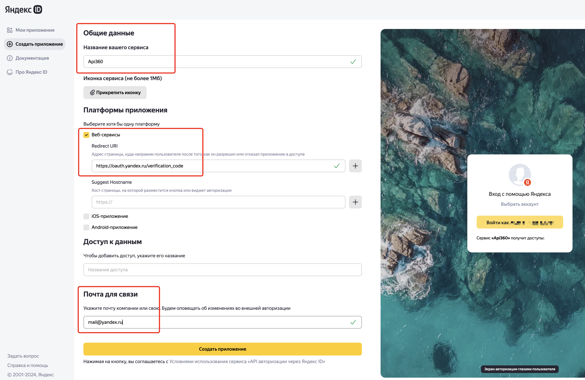

# Добавление пользователей в Yandex 360

## Обзор

Скрипт `add_modify_users.py` предназначен для добавления новых пользователей в Yandex 360 через API. Он читает данные пользователей из CSV-файла (`users.csv`), проверяет их на корректность и отправляет запросы на создание пользователей в Yandex 360. Скрипт поддерживает режим "сухого прогона" (`DRY_RUN`) для тестирования без фактического создания пользователей, а также режим анализа файла для проверки данных без их отправки.

## Функциональность

1. **Чтение данных**:
   - Загружает данные пользователей из CSV-файла, указанного в переменной `USERS_FILE_NAME`.
   - Поддерживает поля: логин, пароль, необходимость смены пароля, имя, фамилия, отчество, должность, пол, дата рождения, язык, рабочий и мобильный телефоны.

2. **Валидация данных**:
   - Проверяет обязательные поля (логин, имя, фамилия, пароль, язык, пол, необходимость смены пароля).
   - Валидирует формат логина (латинские буквы, цифры, точки, дефисы, без начального подчёркивания).
   - Проверяет имена (кириллица, первая буква заглавная, возможен дефис).
   - Проверяет номера телефонов (допустимые символы: цифры, `+`, `-`, `(`, `)`, пробелы, точки; длина 3–16 цифр).
   - Проверяет дату рождения (форматы: `DD.MM.YYYY`, `DD-MM-YYYY`, `YYYY-MM-DD` и др.; возраст 10–100 лет).
   - Проверяет язык (`ru` или `en`) и пол (`male` или `female`).

3. **Создание пользователей**:
   - Отправляет POST-запросы к API Yandex 360 (`https://api360.yandex.net/directory/v1/org/{orgId}/users`) для создания пользователей.
   - Формирует JSON с данными пользователя, включая контакты (рабочий и мобильный телефоны), если они указаны.
   - Поддерживает до 3 повторных попыток при ошибках запроса с задержкой в 1 секунду.

4. **Режимы работы**:
   - **Добавление пользователей**: Создаёт пользователей в Yandex 360 или имитирует создание в режиме `DRY_RUN`.
   - **Анализ файла**: Проверяет CSV-файл на ошибки без отправки данных.

5. **Логирование**:
   - Логирует операции в консоль (уровень INFO) и в ротируемый файл `add_users.log` (уровень DEBUG).
   - Ротация файла происходит при достижении 1 МБ, сохраняется до 5 резервных копий.

## Параметры

Скрипт использует следующие переменные окружения, которые можно задать в файле `.env` в каталоге скрипта или непосредственно в окружении:

| Имя параметра       | Описание                                                                 | Обязательный | Пример значения         |
|---------------------|--------------------------------------------------------------------------|--------------|-------------------------|
| `access_token`      | OAuth-токен для аутентификации в API Yandex 360.                         | Да           | `y0_AgAAAA...`         |
| `orgId`             | Идентификатор организации в Yandex 360 (целочисленный).                  | Да           | `123456`                |
| `USERS_FILE_NAME`   | Имя CSV-файла с данными пользователей.                                   | Да           | `users.csv`             |
| `DRY_RUN`           | Режим "сухого прогона" (`true` для имитации, `false` для реального создания). | Нет (по умолчанию `false`) | `true` или `false` |

### Формат CSV-файла
CSV-файл (`users.csv`) должен содержать следующие столбцы (разделитель `;`):

| Поле                        | Описание                                                                 | Обязательное | Пример значения            |
|-----------------------------|--------------------------------------------------------------------------|--------------|----------------------------|
| `login`                     | Логин пользователя (латинские буквы, цифры, `.`, `-`, без `@domain`).    | Да           | `rpop-test1`               |
| `password`                  | Пароль пользователя.                                                     | Да           | `$rfvBgt5^yhn`             |
| `password_change_required`  | Требуется ли смена пароля (`true` или `false`).                          | Да           | `false`                    |
| `first_name`                | Имя (кириллица, первая буква заглавная).                                 | Да           | `Александр`                |
| `last_name`                 | Фамилия (кириллица, первая буква заглавная).                             | Да           | `Иванов`                   |
| `middle_name`               | Отчество (кириллица, первая буква заглавная).                            | Нет          | `Иванович`                 |
| `position`                  | Должность.                                                               | Нет          | `Директор`                 |
| `gender`                    | Пол (`male` или `female`).                                               | Да           | `male`                     |
| `birthday`                  | Дата рождения (например, `DD.MM.YYYY`).                                  | Нет          | `01.01.2009`               |
| `language`                  | Язык интерфейса (`ru` или `en`).                                         | Да           | `ru`                       |
| `work_phone`                | Рабочий телефон (цифры, `+`, `-`, `(`, `)`, пробелы, точки).             | Нет          | `+71231231212`             |
| `mobile_phone`              | Мобильный телефон (цифры, `+`, `-`, `(`, `)`, пробелы, точки).           | Нет          | `+71231231212`             |

**Пример файла `users.csv`**:
```
"login";"password";"password_change_required";"first_name";"last_name";"middle_name";"position";"gender";"birthday";"language";"work_phone";"mobile_phone"
"rpop-test1";"$rfvBgt5^yhn";"false";"Александр";"Иванов";"Иванович";"Директор";"male";"01.01.2009";"ru";"+71231231212";"+71231231212"
"rpop-test2";"$rfvBgt5^yhn";"true";"Мария";"Петрова";"Петровна";"Администратор";"female";"05.05.1990";"en";"+79879879898";"+71231231212"
"rpop-test3";"$rfvBgt5^yhn";"true";"Павел";"Сидоров";"Александрович";"Менеджер";"male";"20.06.2000";"ru";"+71234567890";"+71231231212"
```

### Примечания к параметрам
- **Переменные окружения**: Обязательные параметры (`access_token`, `orgId`, `USERS_FILE_NAME`) должны быть заданы. При их отсутствии скрипт завершится с ошибкой.
- **CSV-файл**: Файл должен существовать в каталоге скрипта или по указанному пути. Некорректные строки (например, пустые обязательные поля, неверный формат телефона) приведут к остановке обработки.
- **DRY_RUN**: Если `DRY_RUN=true`, скрипт только имитирует создание пользователей, логируя действия без отправки запросов к API.
- **Файл `.env`**: Пример файла `.env`:
  ```
  access_token=y0_AgAAAA...
  orgId=123456
  USERS_FILE_NAME=users.csv
  DRY_RUN=false
  ```
## Настройка OAuth приложения

1. Для работы приложения необходимо сгенериовать OAuth токен для аутентификации в API Яндекс 360. Токен должен содержать необходимые права для выполения операций управления ресурсами в организации Яндекс 360. Документация - [Создание приложения](https://yandex.ru/dev/id/doc/ru/register-client). Последовательность шагов для создания токена:
    * заходим на https://oauth.yandex.ru/client/new/. Аутентифицируемся от имени администратора организации Яндекс 360.
    * Заполняем поля в форме создания приложения:
        - Поле "Название вашего сервиса" - произвольное название.
        - Включаем галочку "Веб сервисы"
        - В поле `Redirect URL` вводим `https://oauth.yandex.ru/verification_code`
        - В разделе "Почта для связи" указываем свой email.
          
        
        
    * Добавляем разрешения для токена. Для этого в разделе "Доступ к данным" ищем и добавляем следующие разрешения:
        | Имя разрешения | Что можно делать |
        |----------------|----------|
        | directory:read_users |  читать информацию о пользователях |
        | directory:write_users | изменять информацию о пользователях |
        
        
        
    * нажимаем на кнопку "Создать приложение".
    * Свойства созданного приложения отображаются в новом окне "Мои приложения". Ищем раздел с идентификатором созданного приложения и копируем строку из поля "ClientID":
      
        
        
    * В текстовом редакторе созадем строку вида `https://oauth.yandex.ru/authorize?response_type=token&client_id=<идентификатор приложения>` и вставляем в ней вместо `<идентификатор приложения>` скопированное значение ClientID из предыдущего пункта. 
    Вставляем получившуюся ссылку в браузер и нажимаем "Enter".
    * В окне браузера появляется запрос на подтверждение прав токена. Подтверждение **необходимо выполнить от учётной записи администратора организации** (если это сделать от имени обычного пользователя, то токен не получит затребованных прав из-за отсутствия необходимых разрешений у данной пользовательской учётной записи).
    Нажимаем "Войти как" и получаем необходимый токен доступа. 
    > [!WARNING]  
    > Копируем токен и сохраняем в надёжном месте.

2. Получить ID организации в Яндекс 360. Для этого необходимо зайти в [консоль администрирования](admin.yandex.ru) и в левом нижнем углу интерфейса будет необходимый номер.
   
   
        
3. Записываем полученные на предыдущем шаге OAuth токен и Org ID в соответствующие переменные в файле файле `.env` в том же каталоге, что и сами скрипты. Эта информация нужна для правильной аутентификации скриптов в API Яндекс 360.

## Установка

1. **Установите Python**: Требуется Python 3.7 или выше.
2. **Установите зависимости**:
   Скрипт требует следующие Python-пакеты:
   - `python-dotenv`: Для загрузки переменных окружения из `.env`.
   - `requests`: Для HTTP-запросов к API Yandex 360.

   Установите их с помощью:
   ```bash
   pip install python-dotenv requests
   ```

3. **Настройте окружение**:
   - Создайте файл `.env` в каталоге скрипта с необходимыми параметрами (см. пример выше).
   - Подготовьте CSV-файл (`users.csv`) с данными пользователей в правильном формате.
   - Убедитесь, что у вас есть действующий OAuth-токен и ID организации Yandex 360.

## Запуск

1. **Подготовка**:
   - Поместите скрипт `add_modify_users.py` и файл `users.csv` в рабочий каталог.
   - Создайте и заполните файл `.env` или задайте переменные окружения.

2. **Запуск скрипта**:
   ```bash
   python add_modify_users.py
   ```
   Это откроет интерактивное меню.

3. **Использование меню**:
   - Выберите опцию в главном меню:
     - `1`: Добавить пользователей из CSV-файла.
     - `2`: Проанализировать CSV-файл на ошибки без добавления пользователей.
     - `0`: Выход.
   - **Добавление пользователей**:
     - Скрипт читает `users.csv`, проверяет данные и отправляет запросы на создание пользователей.
     - Если есть подозрительные строки (например, некорректные имена или логины), запрашивается подтверждение для продолжения.
     - В режиме `DRY_RUN=true` создание имитируется без изменений в Yandex 360.
   - **Анализ файла**:
     - Проверяет CSV-файл на ошибки и выводит отчёт о корректных и некорректных строках.

4. **Пример работы**:
   - Запустите скрипт: `python add_modify_users.py`.
   - Выберите `2` для проверки `users.csv` на ошибки.
   - Исправьте ошибки в файле, если они найдены.
   - Выберите `1` для добавления пользователей.
   - Подтвердите продолжение, если есть подозрительные строки.
   - Проверьте логи в `add_users.log` и консоль для результатов.

## Логирование

- **Консоль**: Сообщения уровня INFO с временными метками (например, `2023-10-01 12:00:00.123 INFO: Добавление пользователей...`).
- **Файл**: Сообщения уровня DEBUG записываются в `add_users.log`, ротация происходит при достижении 1 МБ (хранится 5 резервных копий).
- Формат логов: `%(asctime)s.%(msecs)03d %(levelname)s:\t%(message)s` с форматом даты `ГГГГ-ММ-ДД ЧЧ:ММ:СС`.

## Обработка ошибок

- **Ошибки конфигурации**: Отсутствие переменных `access_token`, `orgId` или `USERS_FILE_NAME` приводит к завершению с ошибкой.
- **Ошибки данных**: Некорректные строки в CSV-файле (например, пустые обязательные поля, неверный формат телефона) логируются как ошибки, и процесс останавливается.
- **Ошибки API**: Обрабатываются с повторными попытками (до 3 раз). Ошибки аутентификации (401, 403) или неверные запросы (400) логируются.
- **Подозрительные строки**: Строки с потенциально некорректными данными (например, некириллические имена) логируются как предупреждения, и пользователь решает, продолжать ли.

## Ограничения

- **Формат логина**: Логин не должен содержать `@domain`, начинаться с `_` или включать символы, кроме латинских букв, цифр, `.`, `-`.
- **Имена**: Имена, фамилии и отчества должны быть на кириллице с заглавной первой буквой, возможен дефис.
- **Телефоны**: Длина номера 3–16 цифр, поддерживаются международные и российские форматы.
- **Дата рождения**: Возраст должен быть от 10 до 100 лет.
- **API-запросы**: Ограничены скоростью (обрабатывается код 429 с ожиданием по заголовку `Retry-After`).

## Лицензия

Проект распространяется под лицензией MIT. Подробности см. в файле `LICENSE`.